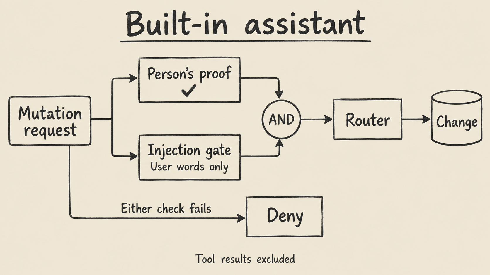

An **MCP server for business data** gives an AI agent a defined way to inspect data and request actions. In Undercroft, that means working with information ingested from Xero, Gmail, Google Drive and HubSpot through the platform's own procedures. The agent acts with the person's Undercroft permissions, bounded further by a read or write grant. Connecting a model does not give it a database administrator's credentials.

There are three pieces to understand: MCP exposes tools, the CLI exposes commands, and skills teach an agent how to use them. Undercroft also has a built-in assistant with a separate injection gate for mutations. Knowing which protection belongs to which route matters before asking an agent to change anything.

## What does an MCP server for business data actually expose?

Undercroft serves MCP at `/mcp` on its control plane. The endpoint exposes the router's procedures as tools, with deliberate exclusions such as account credential management. Tool inputs use the procedures' own schemas. A procedure named `runs.list` becomes `runs_list`; `bi.questions.save` becomes `bi_questions_save`.

Each MCP call goes through `appRouter.createCaller(ctx)`. That is the same router used by the built-in assistant, with the platform's existing role checks and refusals. MCP is another entrance to the application, with no separate business permission system for an agent to learn or bypass.

The [Undercroft repository](https://github.com/muitneliss/undercroft) contains the implementation and setup guides. It is an open-source data platform: source records land in an immutable raw data lake, and people define dbt models for analysis. MCP makes those platform capabilities available to an external client; it does not replace ingestion or define your metrics.

## How can an agent work with Xero, Gmail, Drive and HubSpot?

First connect the sources, choose their scope and run ingestion. Source access and agent access are separate decisions. Approving an MCP connection does not also authorize a mailbox or select a Xero organisation.

| Source       | What must be established before analysis                                                  |
| ------------ | ----------------------------------------------------------------------------------------- |
| Xero         | An OAuth connection, the chosen organisation and the entities its granted scopes can read |
| Gmail        | A connected account and selected labels; additional mailboxes have separate connections   |
| Google Drive | A connected account and the selected files or folders to ingest                           |
| HubSpot      | A private app token with the read scopes needed for the chosen objects                    |

Once data is held, an authorized agent can inspect runs, discover models, read reports or use the lake tools its role permits. A useful initial request is: “Show the latest runs and identify which sources are missing data.” That establishes the evidence available before asking a business question.

Cross-source analysis still needs explicit definitions. A deal in HubSpot and an invoice in Xero are not automatically the same business event. Put the join rules and metric definitions in a dbt model, then query its output. The guides to [Xero integration with Postgres](/en/xero-integration-postgres/) and [Xero reporting with SQL and dbt](/en/xero-reporting-sql-dbt/) explain that foundation.

For document-based questions, check what actually landed and what text is available. The [Gmail integration guide](/en/gmail-integration-email-to-database/) and [Google Drive OCR guide](/en/google-drive-integration-ocr-search/) cover those source paths. An agent should report missing evidence rather than infer the contents of an unread document.

## How do you connect Claude, ChatGPT or another AI agent?

A compatible remote MCP client connects to your control plane's `/mcp` URL. Undercroft supports OAuth sign-in and personal access tokens. Its setup guide documents claude.ai, Claude Desktop and Claude Code; for ChatGPT or another host, use that host's supported remote MCP connection flow. Tool access, widgets and skill discovery are separate host capabilities, so do not assume support for one means support for all three.

With OAuth, the client sends you through Undercroft's own sign-in and consent pages. Use the invited address, sign in with Google or an emailed code, and choose read only unless you intend to allow changes. The connected app appears on your account page, where revoking it stops its access at the next call.

For Claude Code, the documented command is below. The URL is an illustrative placeholder: replace it with your deployment's actual origin.

```sh
claude mcp add --transport http undercroft https://undercroft.example.test/mcp
```

Then open `/mcp` in Claude Code, select `undercroft` and authenticate. The [MCP setup runbook](https://github.com/muitneliss/undercroft/blob/main/docs/runbook/mcp-setup.md) contains the other connection options and troubleshooting steps.

For a client that accepts headers but cannot complete browser sign-in, mint a personal access token on `/account`. Choose its grant and expiry, copy it when shown, and configure the client's `Authorization: Bearer` header. A browser cookie alone does not authenticate `/mcp`.

## Does the AI agent get exactly my permissions?

Your identity sets the maximum reach; the credential's grant can narrow it. A personal token reaches the tenants you belong to with your role in each. It is not confined to whichever tenant you happened to have open when you created it, and it cannot make you an admin somewhere you are a viewer.

A `read` grant exposes only tools classified as reads. A `write` grant allows write tools, subject to the same role checks. The router enforces the grant again when a tool is called; hiding a tool from the list is not the only check. A read credential cannot mint itself a write credential, because account procedures require a browser or CLI session.

One classification deserves attention: `lake_query` requires a write grant even though its SQL reads data. Undercroft deliberately treats running admin-authored SQL against the raw lake as an operation needing explicit opt-in. “Read-only connection” therefore does not mean unrestricted SQL access.

Removing the person's access removes the credential's access on the next request. OAuth consent is also checked on every call. A non-member receives `NOT_FOUND`, preserving the same boundary the web UI uses instead of revealing whether another tenant exists.

## How does the injection gate protect mutations?

The **built-in assistant** requires two checks for a mutation: the person's confirmation of a proposed proof, and an independent injection gate's agreement that the person asked for the action. A proof presents the proposed change and arguments for review. Its confirmation wording comes from the application, not from the model proposing the action.



The gate evaluates the person's own turns with tool results excluded. That separation matters when an email or document contains instructions such as “disconnect this source.” Those words are data supplied by someone else; they must not become the person's request merely because the assistant read them.

If the gate is unavailable or unconfigured, mutations are denied. Operators also configure an approval secret for tamper-proof signed approvals; without that secret, approvals are unsigned. The [assistant setup guide](https://github.com/muitneliss/undercroft/blob/main/docs/runbook/assistant-setup.md) states these configuration limits.

This two-check flow belongs to the built-in assistant. External MCP clients use grants, router permissions and their host's confirmation behavior; the CLI uses its own write opt-in. The published skill requires confirmation for an exact destructive action. These mechanisms do not mean every external tool call passes through the built-in assistant's judge.

## When should you use the CLI and agent skills?

Use MCP when the agent's host offers Undercroft tools. Use the CLI when the agent can run commands and no MCP tools are available. The CLI signs in as the person and calls `/trpc` over HTTP. It does not connect directly to Postgres or use a service credential.

Each CLI environment profile has `allowWrites`, off by default. Only a person at a terminal can enable it; an agent attempting that change receives `HUMAN_REQUIRED`. A one-off `--url` never permits writes. In agent mode, commands return one JSON envelope, and destructive commands require `--yes` for the specifically authorized action.

Skills supply the workflow around those capabilities. The `undercroft` skill prefers MCP when available and otherwise uses the CLI. It tells agents to discover operations, read before writing, obtain real IDs from results and report refusals accurately.

The `undercroft-model-builder` workflow interviews the person, inspects the lake, drafts a dbt model and runs `models.check`. It asks before saving and again before building. The check reports errors, warnings and what it cannot verify; it does not prove SQL compilation, field existence or passing tests.

Install the published skills using the [agent skills runbook](https://github.com/muitneliss/undercroft/blob/main/docs/runbook/agent-skills.md). The same files are served through the MCP Skills extension for hosts that support it. Do not assume merely connecting MCP has loaded those workflows.

## How do you check an answer before relying on it?

Ask which tenant, source, run and model support the answer. A saved report question reads a built model, so it is no fresher than that model's last build. A fluent answer cannot make an earlier sync current.

Also check whether a result was clipped. MCP returns the whole result in `structuredContent`, but its text representation limits lists to 50 items and total text to 60 KB, with a truncation note. An agent must not present a clipped list as complete. Keep missing amounts missing, preserve currencies, and resolve gaps before treating an answer as a financial conclusion.

## FAQ

### Can I use Claude MCP with Xero data?

Yes, through Undercroft after Xero is connected and its data has been ingested. Claude accesses that data through the tools your Undercroft role and MCP grant permit.

### Can ChatGPT use the same MCP server?

A ChatGPT setup that supports a compatible remote MCP connection can use the endpoint. Follow the host's connection flow and check its tool, widget and skill support separately.

### Can I chat with my data without allowing writes?

Start with a read grant for the MCP connection. It permits classified read tools, while operations such as `lake_query` still require write authorization and the appropriate role.

### Can every assistant build dbt models?

An external agent can follow the model-builder skill through MCP or the CLI with the required permissions. Undercroft's built-in assistant does not author or build dbt models, and drafts lake SQL for a person to review and run.
