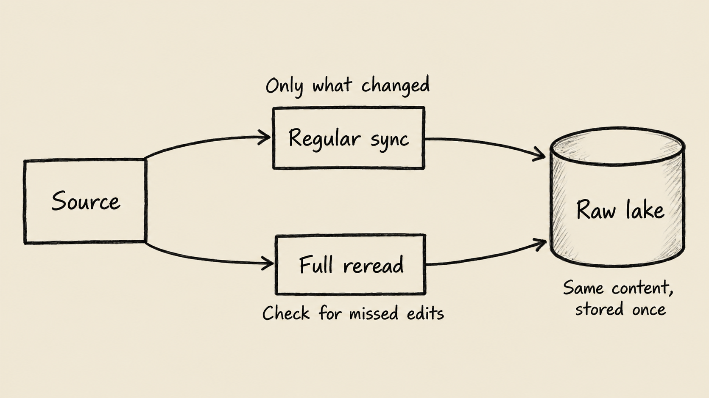

Data integration makes information from separate systems useful together. A sales team may track relationships in HubSpot, finance may keep invoices in Xero, and supporting documents may arrive through Gmail. When someone asks which sales have become paid invoices, those separate views need to meet. Otherwise, each reporting cycle starts with exports, manual matching, and arguments about whose spreadsheet is current.

The business problem is bigger than moving data. People need to know what was collected, what is missing, and how a report reached its answer. A faster dashboard is not much help if a failed collection looks like a quiet month.

## What is data integration, and how does it work?

Think of data integration as bringing evidence to a shared workbench. The source systems provide the material; the business supplies the rules for interpreting it. Bringing a sales record and an invoice together does not automatically establish that they represent the same transaction.

A data pipeline is the sequence of steps that collects, stores, and prepares that material. A connector is the part that knows how to read a particular source. A REST API is a way an application lets another system request information with permission.

Reliable integration needs all these parts, plus agreed definitions. Does a sale count when it is agreed, invoiced, or paid? That choice belongs to the business and determines what engineering must build into the report.

## How does Undercroft bring data sources together?

Undercroft separates collecting evidence from interpreting it. It saves raw data in an immutable data lake, makes collected records available in Postgres, and lets your team define business models with dbt. Those models prepare the data for reports and BI.

Immutable means the saved content is not overwritten in place. Reading identical content again does not create another stored copy; changed content can be kept as a new version. If a reporting rule changes, your team can rebuild the analysis from retained raw data instead of relying entirely on another export. The [immutable raw data lake guide](/en/immutable-raw-data-lake/) explains why that matters.

For supported REST APIs, Undercroft uses a shared connector approach: describe how a source is read, then reuse the machinery that performs the collection. Xero and HubSpot use this approach. Gmail and Google Drive need dedicated collectors for message and document content, but feed the same raw lake.

This reduces repeated engineering work without making every source interchangeable. Adding a supported source still requires development and a release. An unusual source may need a custom collection path; a connector cannot manufacture information the source does not expose.

## How is data integration different from ETL and ELT?

Data integration is the goal. ETL and ELT describe where the preparation happens along the way.

| Approach | Plain meaning                                              | Main consideration                                              |
| -------- | ---------------------------------------------------------- | --------------------------------------------------------------- |
| ETL      | Extract data, transform it, then load the prepared result. | Decide how to prepare the data before loading it.               |
| ELT      | Extract data, load it, then transform it for analysis.     | Keep collected material available while reporting rules evolve. |

Undercroft follows an ELT approach, preserving raw data before your team's transformations. It does not ship a business schema that decides what a customer or revenue means. That flexibility is useful when departments need different views, but someone must own the definitions and maintain the models. See [ETL versus ELT](/en/etl-vs-elt/) for the broader comparison.

## How does incremental sync keep data up to date?

Incremental sync focuses later collection on what changed since an earlier read. Imagine a bookmark in a long ledger: after finishing a section, you record where to continue. Undercroft advances that bookmark only after the relevant list has been read completely. An interruption does not turn partial progress into a claim that the rest was checked.

The saving depends on the source. Some APIs return only changed records. Others still require reading the full list before Undercroft can avoid storing older records again. Incremental sync can therefore reduce later processing without reducing requests to the source.

A source's change tracking can also miss edits. For eligible connections, Undercroft offers an optional full reread schedule to catch changes that ordinary incremental reads may not reveal. The diagram shows these complementary approaches; the full reread must be enabled where needed. It consumes more source capacity and is not a guarantee of immediate freshness.

## How can you tell whether a sync is complete?

A successful connection proves that some communication worked. It does not prove that every needed record arrived. Permission gaps, temporary failures, and provider limits all affect what a report can know.

Undercroft paces requests, retries selected temporary failures, and reports connector errors rather than disguising them as empty results. Its run journal records progress and warnings so an administrator can inspect what happened after the run, even if nobody watched it live.

Read those warnings alongside the result counts. A run can finish with a warning that part of a full read paused, or that access to a list was not granted. “Nothing changed,” “nothing exists,” and “we could not read it” have different business meanings. None should be silently treated as the others.

## When does this approach fit, and when does it not?

Undercroft fits teams that want control over retained source data and are prepared to own their reporting logic. It is especially relevant when reports evolve and the team needs to revisit the evidence behind an earlier interpretation.

The trade-off is responsibility. A self-hosted platform needs operational ownership, and flexible models need people who understand both the data and the business. Retaining raw data also requires storage and access decisions. Undercroft is open-source and pre-alpha, so it is still under active construction.

It is a weaker fit if you need a managed service with minimal operational involvement, finished business reports immediately, or guaranteed instantaneous updates. Scheduled collection has limits, and a successful sync cannot repair an incorrect business definition.

## How can you get started with data integration?

Start with a business question whose answer you can check, then identify its sources and acceptable delay. Explore [Undercroft](https://undercroft.lowbit.link) and review the [project repository](https://github.com/muitneliss/undercroft) to assess the product and setup requirements. A small evaluation should establish both that the necessary evidence arrives and that your model interprets it correctly.

## FAQ

### Is data integration the same as ETL?

No. Data integration is the broader goal of making sources useful together, while ETL is one way to organize the work. Undercroft follows ELT, saving raw data before business transformations.

### Can any REST API connect to Undercroft?

The shared connector approach covers supported ways of reading REST APIs. Sources outside those capabilities need additional engineering, and making a new source available in the product requires a release.

### Does incremental sync always reduce API calls?

No, some sources still require reading every page to identify changes. The saving may be in storage and later processing rather than requests to the source.

### Does data integration provide real-time reporting?

Not necessarily: freshness depends on collection schedules, source behavior, and later processing. Undercroft uses scheduled syncs, so evaluate the delay your decisions can tolerate rather than assuming every change appears immediately.
