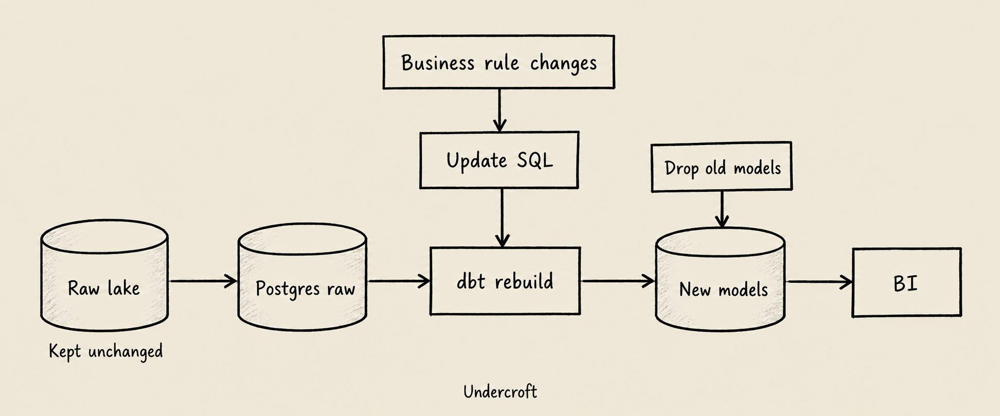

ETL vs ELT is a question about when you apply meaning to source data. ETL transforms data before loading it into an analytical destination; ELT loads it first and transforms it there. The practical difference appears when finance changes a reporting rule or operations asks a question the original pipeline never anticipated: do you still have the inputs needed to calculate a different answer?

Undercroft provides a concrete example of keeping those inputs. Its flow is REST sources → immutable raw lake on S3 or MinIO → Postgres → user-authored dbt models → BI. Understanding the separate jobs of those layers makes the choice more useful than simply rearranging three letters.

## What is ETL, and how does an ETL pipeline work?

ETL means **extract, transform, load**. Extract reads a source; transform selects, cleans, joins or aggregates its data; load writes the result to the destination. An ETL pipeline might read order records, assign them to reporting categories, and load monthly totals into a data warehouse.

This design gives the destination a defined shape. Consumers receive prepared fields, and the transformation stage can remove information that the destination should not hold. It fits a narrow reporting contract when the input rules and required outputs are understood before ingestion.

The tradeoff is deciding early what matters. If the pipeline keeps only monthly totals, a later request for daily counts cannot be answered from those totals alone. The team needs retained detail somewhere else or must extract it again, assuming the source still provides it.

ETL does not inherently require deleting raw data. The hero illustrates an ETL design that discards it, alongside an ELT design that keeps it. An ETL pipeline with a separate raw archive can also support rebuilding; the archive, not the acronym, provides that option.

## What is ELT, and how does an ELT pipeline work?

ELT means **extract, load, transform**. Source data reaches the analytical environment before business transformations run. Teams can then use SQL to turn the loaded records into models for different questions, without making the extraction code own every reporting definition.

An ELT pipeline separates capture from interpretation. A connector handles reading the source, while a model defines concepts such as an active account or a fulfilled order. Changing that definition normally changes the model rather than the connector, provided the required fields were captured.

“Load first” does not mean “skip validation.” Authentication, record identity, safe storage and handling failed reads still matter. Nor does loading raw data automatically make it suitable for a dashboard. Someone must define types, relationships, missing-value behavior and business rules before treating a result as a reliable metric.

## ETL vs ELT: what are the main differences?

Both approaches move data toward analysis. Their main difference is where business transformation sits relative to the load into the analytical destination.

| Question                            | ETL                                          | ELT                                         |
| ----------------------------------- | -------------------------------------------- | ------------------------------------------- |
| When are business rules applied?    | Before the analytical load                   | After the analytical load                   |
| What reaches the destination first? | Prepared data                                | Source-shaped data                          |
| Where does transformation run?      | In an upstream processing stage              | In the analytical environment               |
| What supports a changed definition? | Retained inputs or a fresh extraction        | Loaded inputs, if the needed detail remains |
| What must the team manage?          | Upstream transformation and output contracts | Raw access, storage and downstream models   |

Neither label guarantees lower cost, faster queries or better quality. Those depend on data volume, transformation complexity, infrastructure and how the team operates it. A useful comparison asks which layer owns a rule, what information survives that rule, and what rebuilding would require.

## When should you choose ETL or ELT?

Consider ETL when the destination should receive a tightly limited dataset, when transformation needs to happen before that boundary, or when an existing downstream interface requires a stable schema. Keep an archive if future reinterpretation matters and retaining that data is appropriate.

Consider ELT when several teams need different views of the same records, when definitions change frequently, or when analysts maintain SQL models. It is especially useful when today's report is unlikely to be the last question asked of a source.

For example, operations may count fulfilled orders while finance groups the same records by a different reporting date. Keeping the underlying fields allows separate models with explicit definitions. Storing only one team's aggregate can force the other team back to the source.

A practical evaluation starts with three questions: which fields must survive, who maintains the rules, and how will a corrected rule be applied to older data? Your answers may lead to a mix of both patterns across different boundaries.

## How does Undercroft implement an ELT pipeline?

The [Undercroft repository](https://github.com/muitneliss/undercroft) describes an open-source platform that is currently pre-alpha. Its architecture puts an immutable raw lake beneath the queryable layers, rather than making a curated table the only remaining copy of a source record.

The record flow has five steps:

1. **Extract from a REST source.** YAML connector specifications describe how to read it. Xero and HubSpot are included examples; the [data integration and YAML connector guide](/en/data-integration-rest-api-yaml-connectors/) explains that boundary.
2. **Land data in S3 or MinIO.** Lake writes are create-only and content-addressed. Identical bytes do not need another blob, and existing objects are not overwritten in place.
3. **Project records into Postgres.** Records from different sources share `raw.records`, with their bodies stored as `jsonb`. This is a queryable projection of the lake.
4. **Build business models with dbt.** The worker invokes `dbt build` as a subprocess. Users author the SQL that defines their analytical tables.
5. **Read the built models through BI.** The Reports division provides questions and dashboards. Its tenant BI login reads the tenant's analytical models, not the raw schema.

Undercroft ships no business schema. There is no platform-defined meaning of “customer” or “invoice” to inherit accidentally. That flexibility also leaves responsibility with the model author: a generic record store does not enforce your business contracts for you.

The [raw data lake explanation](/en/immutable-raw-data-lake/) covers why the lake is the durable layer. Postgres supplies projections for querying; it is not a replacement for captured source bytes.

## What happens when a business rule changes?

Suppose the fictional company Acme originally labels a customer active after an order in the previous 30 days. Operations later chooses 90 days. This is an illustrative business model, not a schema or rule shipped by Undercroft.

If the only stored value is a Boolean calculated under the old rule, it does not reveal the last order date. If captured records retain the necessary dates and identifiers, a user-authored model can calculate the new answer from those inputs.

This illustrative SQL shows only the changed condition. `customer_activity` and its columns stand for a model the team would have to define; they are not built-in Undercroft tables.

```sql
-- Illustrative: replace the previous 30-day condition.
select customer_id,
       last_order_date >= date '2026-09-29' - interval '90 days'
         as is_active
from customer_activity;
```

The fixed evaluation date makes the example reviewable. A missing `last_order_date` leaves the comparison unknown rather than inventing evidence of activity.



In Undercroft's design, derived data can be dropped and rebuilt while the raw lake remains. A model-only change can use the existing Postgres projection; if that projection needs reconstruction, the lake is the underlying source. The diagram shows this dependency, not a requirement to drop every table for every edit.

Keep the model definitions, confirm the relevant inputs exist, revise the SQL, then build and check the affected outputs and their dependents. Rebuilding changes stored results; it does not prove the new definition is correct. For a finance-oriented application of this separation, see [Xero reporting with SQL and dbt](/en/xero-reporting-sql-dbt/).

## What can keeping raw data fail to recover?

A raw lake preserves observations, not everything that ever happened in the source. A field never requested, a record deleted before capture, or an unobserved intermediate version cannot be recreated by changing SQL.

Also distinguish history in the lake from the ordinary query projection: `raw.records` represents the newest observation per record. Keeping versions underneath it does not automatically give every model a historical view. Historical analysis needs the right retained inputs and a model designed to use them.

Retention and model definitions matter too. Rebuilding requires accessible data and the logic that interprets it. “Every model is rebuildable” describes the architecture's dependency on retained raw inputs; it is not a promise of unlimited history or automatic recovery of missing business knowledge.

## FAQ

### Is ELT always better than ETL?

No. ETL fits transformations required before the analytical destination, while ELT fits downstream modeling over retained inputs. Choose based on the data boundary, the team's skills and the cost of changing a rule.

### Does ETL always throw away raw data?

No; an ETL pipeline can keep an independent raw archive. Losing the inputs is a retention decision, although loading only transformed results makes that loss easy to overlook.

### Is dbt an ETL tool or an ELT tool?

In Undercroft, dbt handles the transformation part of ELT after data has reached the lake and Postgres. Connectors and lake writes handle extraction and landing; dbt does not replace them.

### Can Undercroft rebuild models without calling the source API?

Models can be rebuilt from the required data already captured and retained, using the Postgres projection or reconstructing it from the lake. If a revised rule needs data that was never captured, another extraction may be necessary and may no longer be possible.
