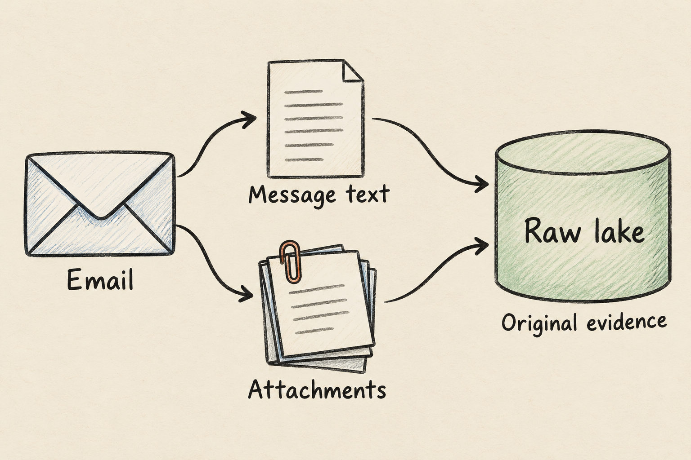

A Gmail integration becomes useful when important business evidence lives in email but the people preparing reports cannot reliably find it. An attachment may contain an invoice, while the message explains a disputed charge or a revised delivery date. Downloading the file alone loses context; copying details into a spreadsheet makes that context harder to check later.

For finance and operations teams, the cost is repeated searching, manual handovers and uncertainty about missing information. For engineers, the challenge is making email useful without pretending that every message is already a clean business record. Undercroft approaches this by preserving selected email content first, then making it available for analysis.

## Why connect Gmail to a database for reporting?

A mailbox organises conversations. A report needs consistent answers across them: which documents arrived, what they say, and how they relate to the business. These are different jobs. A search for “invoice” can return an invoice, a reminder, or a reply quoting an earlier message.

Think of email as a folder of supporting evidence. Bringing that folder into a data platform makes its contents easier to search and use alongside other sources. It does not settle whether a document is valid or whether a payment is outstanding. Those conclusions still need business rules and, where appropriate, human review.

This is particularly useful when explanations arrive in Gmail while structured accounting records live elsewhere. The [Xero integration overview](/en/xero-integration-postgres/) describes that complementary source; email adds context that an accounting record may not contain.

## How does Gmail integration work in Undercroft?

Undercroft collects messages from the Gmail labels you select. It preserves their message text and the attachment types you allow in a raw data lake, then extracts readable text into Postgres. Your team builds models that turn this material into information suitable for reporting.

The idea resembles keeping original documents beside a working summary. The original is the evidence; the summary can change as your understanding improves. Undercroft keeps captured material separate from the database views derived from it, so those views can be rebuilt without replacing the evidence.

That separation is central to the [immutable raw data lake approach](/en/immutable-raw-data-lake/). It also follows the principle explained in [ETL vs ELT](/en/etl-vs-elt/): collect the source material before applying the business interpretation. You can refine a report later without depending on the mailbox to provide the same material again.

## What email content and attachments can it collect?

Message text matters as much as attached files. A supplier might explain a correction in the email while leaving the original document attached. Undercroft preserves the message body separately from its attachments, and attachment choices do not exclude the body of a selected message.

Common documents such as PDFs, supported Word documents and modern Excel workbooks can yield readable content. Supported scans and images can be read with OCR in Vietnamese and English. Collecting a file and successfully reading it are separate outcomes: password protection, damage or an unsupported format can prevent extraction.

The platform records why it could not read a document and identifies incomplete extraction. A successful collection therefore does not mean every document is ready for a report. Teams need to distinguish material still waiting to be read from material that could not be read at all.

## Can email become a reliable business report automatically?

Text extraction gives your team words to work with, not approved transactions. Undercroft does not ship a ready-made invoice schema that decides line items, totals or payment status for every business. Your team defines those meanings through its own dbt models, which organise and check the data for reporting.

A useful rule is that missing evidence stays missing. An unreadable amount should not become zero, and a document mentioning a payment should not automatically count as proof that it happened. Replies may quote previous messages, so reporting rules also need to avoid counting the same business event repeatedly.

Optional document classification can suggest what kind of document a text represents using categories your organisation controls. Uncertain or outdated classifications are not treated as accepted answers. Classification is separate from ordinary extraction and sends text to an external AI provider when enabled; an “invoice” label still does not validate the contents or approve a payment.

## What control do you have over collection and access?

You choose the Gmail labels and attachment types relevant to the work. Selecting several labels includes messages from any of them, and an absent selection causes collection to fail rather than silently expand to the whole mailbox. Signing in with Google is also separate from authorising email collection.

There is an important boundary to understand: Google grants mailbox reading permission, while Undercroft enforces the selected-label collection scope. The permission itself is broader than the labels. Inside the platform, BI access does not expose raw email content directly; your team's models determine what reaches reporting.

Repeat collection normally skips messages already held. Widening attachment choices can bring in previously excluded attachments from selected messages, while narrowing those choices does not delete material already collected. Choose the scope with that persistence in mind.

## When is this approach a good fit?

Undercroft fits teams that need searchable evidence, want to combine email with other business data, and have engineering capacity to maintain models and operate a self-hosted platform. Keeping source material gives them room to change reporting rules and investigate discrepancies later.

The trade-off is responsibility. Someone must own collection choices, access, unreadable documents and the meaning of each report. Open-source software makes the approach inspectable, but does not remove that work.

It is a poor fit if you need a ready-made invoice approval service, a complete mailbox backup, or guaranteed accurate extraction from every attachment. If the immediate task is simply forwarding a document to a colleague, a data platform may add more work than it saves.

## How can you get started?

Start with a recurring question your team struggles to answer from email and a focused set of relevant messages. Explore [Undercroft](https://undercroft.lowbit.link), review the [open-source repository](https://github.com/muitneliss/undercroft), and use the [Google connection runbook](https://github.com/muitneliss/undercroft/blob/main/docs/runbook/google-ingestion-setup.md) when your team is ready to connect a mailbox. Judge the result by whether you can trace an answer back to readable evidence and see what remains missing.

## FAQ

### Does Gmail integration read my whole inbox?

Undercroft collects from your selected labels and refuses to proceed without a saved selection. Google's mailbox reading permission is broader, so label selection is a collection rule enforced by Undercroft.

### Can I save Gmail message text without attachments?

Message text is collected independently of attachment-type choices. It is preserved as a document and becomes searchable after text extraction.

### Can it extract invoices from scanned email attachments?

Supported scans and images can be read through OCR in Vietnamese and English. The resulting text still needs validation and business rules before it becomes trustworthy invoice data.

### Does a successful Gmail sync mean my report is complete?

No, because collection and text extraction happen separately. Some documents may still be waiting or unreadable, and your reporting models must account for those gaps.
