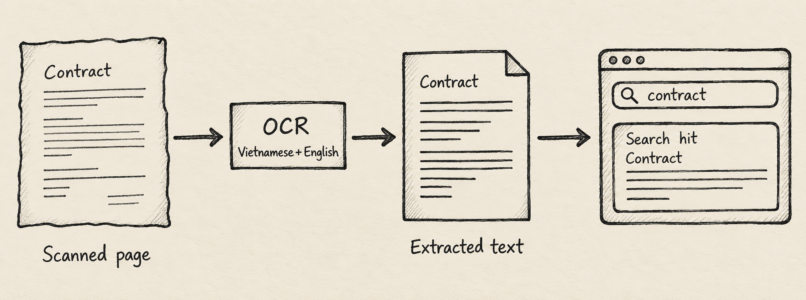

A Google Drive integration can help when storing documents is easy but finding the evidence inside them is slow. A finance lead needs the invoice behind a payment; an operations manager needs the agreement that mentions a renewal. If answering means opening files until something looks familiar, the folder structure has become a bottleneck.

The business problem is larger than finding a filename. Relevant words may sit inside a scanned page, while related records live in another system. Undercroft brings selected Drive material into a shared data platform, preserves what it captures, and makes readable content searchable. The value is a shorter route to evidence, with clear boundaries around what the system could actually read.

## What does Google Drive integration add to document storage?

Think of a document collection as a library. Shelves keep the books safe, a catalogue helps locate them, and an index points to words inside them. Each serves a different purpose. Having a book on a shelf does not mean every page has been indexed.

Undercroft makes a similar distinction. Capturing a file preserves it; extracting text makes its contents available for search; optional classification gives it a category such as invoice or contract. These activities are separate, so a reading failure does not erase a successfully captured document.

This matters when someone asks whether a collection is ready to use. “We have the files” and “we can search their contents” are different answers. Keeping that distinction visible helps a team investigate gaps before relying on a search result or building a report.

## How does Undercroft collect and preserve Drive documents?

An administrator connects a Google account and chooses files or folders, the file types to include, and whether to include nested folders. The selection defines what Undercroft collects. Google's read permission is broader than that selection, however, so the application enforces the boundary. Teams should assess both the permission granted and the material selected.

Captured files go into an immutable raw data lake: a preserved source collection from which later processing can be rebuilt. A downloaded file is retained intact. Google Docs, Sheets and Slides need an exported representation, so what is preserved is that export rather than the live editing experience in Google.

The practical benefit is continuity. If text extraction fails or reporting needs change, the captured material remains available as a reference. The [guide to an immutable raw data lake](/en/immutable-raw-data-lake/) explains why separating preservation from interpretation matters. When documents also arrive by email, [Gmail integration](/en/gmail-integration-email-to-database/) provides another collection route into the same platform.

## Can OCR make scanned documents searchable?

OCR recognises words in pictures of text. It gives a scanned contract or photographed page a text representation that search can use. Undercroft supports Vietnamese and English OCR for supported images and scanned PDFs, alongside direct text extraction from readable documents and spreadsheets.

For PDFs, it tries the existing text first and uses OCR when there is too little readable text. This does not mean every image inside a PDF with substantial text will also be read. A mixed document can therefore contain content that search does not reach.

Scan quality matters. Blurred characters, faint printing and awkward layouts can produce missing or incorrect words. Undercroft records a reason when it cannot read a document; unsupported formats and locked documents can remain preserved without becoming searchable. The [supported document formats reference](https://github.com/muitneliss/undercroft/blob/main/docs/reference/file-formats.md) helps assess a collection before adoption.

For a finance team, searchable text is useful evidence to inspect, but it is not verified accounting data. Important amounts, dates and references still need comparison with the original. A successful OCR run alone cannot establish that those details are correct.

## How do search and document classification work together?

Undercroft gives administrators a search box covering extracted document text and raw record values from connected sources. Vietnamese searches can match without accent marks while excerpts retain the original accents. English matching also recognises related word forms, such as singular and plural forms.

Search works without classification. Optional classification reads extracted text and assigns categories from a catalogue the organisation controls. An uncertain result is not treated as an accepted category, and a general “other” category avoids forcing every document into an unsuitable label.

Classification uses an external AI provider and requires an administrator's explicit action. Teams need to decide whether sending document text to that provider is acceptable and account for the processing cost. Changing the published categories leads to classification being revisited, which is another reason to agree on useful categories before expanding the collection.

A category helps organise documents; it does not supply a finished business model. Calling something an invoice does not establish its line items or make it ready for a financial dashboard. The team still defines how evidence becomes reporting data.

## When is this approach useful, and when is it a poor fit?

The approach suits teams that want documents alongside other source data, preserved material they can revisit, and control over how reports are built. It is particularly useful when questions cross folders and systems rather than staying inside a single Drive collection.

The trade-offs should shape the decision:

- **Operational ownership:** a self-hosted platform gives the team control but requires someone to maintain it and investigate failed processing.
- **Search boundaries:** this is word-based search, without guaranteed correction of OCR mistakes or understanding of meaning. Very long content may be only partly searchable; no result does not prove the original lacks the information.
- **Access boundaries:** lake search is for administrators. It is not a ready-made search portal for every employee.
- **Business preparation:** categories and extracted text still need review and modelling before they support dependable reporting.

If the need is occasional lookup within Drive, another platform may add unnecessary work. If the requirement is fully automatic invoice approval or perfect reading of every scan, this workflow does not meet it on its own.

## How can you get started?

Start with a representative collection and a business question, then assess what becomes readable, what remains missing, and who will review the results. Explore [Undercroft](https://undercroft.lowbit.link) and give the implementation owner the [Google connection setup guide](https://github.com/muitneliss/undercroft/blob/main/docs/runbook/google-ingestion-setup.md) for the operational steps.

## FAQ

### Does Google Drive integration read my whole Drive?

Undercroft collects the files and folders in the administrator's saved selection. The Google permission is broader, so the application is responsible for enforcing that selection.

### Can I search scanned Vietnamese PDFs?

Supported scans can become searchable through Vietnamese and English OCR. The quality of the source affects the result, so check representative pages before relying on the collection.

### Do I need AI classification to search documents?

No, search uses extracted text independently of document categories. Classification is an optional decision with its own provider and processing considerations.

### Does OCR turn invoices into reporting data automatically?

OCR produces text, which may contain mistakes. Your team must validate important details and define the business models used for reports.
