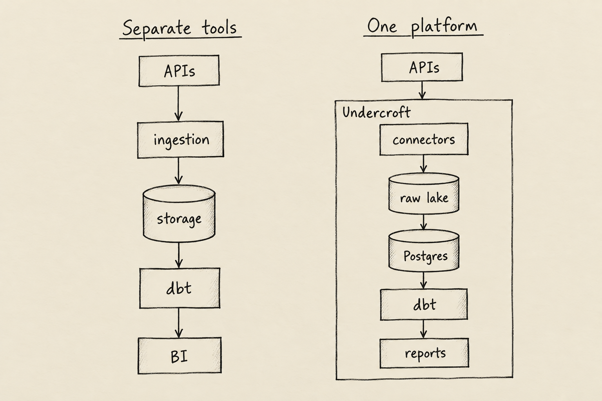

Choosing an open-source data platform starts with a business question: can your team explain where a report's numbers came from and change the calculation without losing the evidence? When information is scattered across accounting software, customer systems and documents, preparing a dashboard often means repeating exports and reconciling conflicting copies. The cost appears as delayed decisions and time spent defending numbers instead of using them.

Undercroft brings data collection, retained raw data, analytical models and reporting into a self-hosted product. It is worth evaluating when you want control over that whole journey. The important qualification is maturity: the project is **pre-alpha**, with nothing stable yet, so an evaluation should begin with a bounded reporting problem.

## What should an open-source data platform help you control?

Open-source means your team can inspect and adapt the software. Undercroft's code uses the MIT licence. Self-hosting is a separate choice: you run the platform and control its storage, while also taking responsibility for keeping it available.

That control matters beyond where a server sits. You should be able to distinguish the information collected from a source, the business rules applied to it, and the results people see. If those are blurred together, changing a definition can mean starting the data collection work again.

A useful evaluation therefore asks who owns the evidence, who agrees the calculations, and who handles failures. Access to source code helps with transparency, but it does not answer those organisational questions for you.

## How does ELT turn source data into useful reports?

ELT means collecting data, storing it, then transforming it for analysis. Think of keeping the original documents alongside a working summary. The summary can change as your questions change; the originals remain available to check how you reached an answer.

Undercroft follows that sequence. Connectors collect source data, a raw data lake preserves what arrived, and Postgres makes it available for analysis. Your team defines dbt models: reusable rules that shape the collected information into something useful. Built-in BI then presents saved questions and dashboards over those models.

Bringing those stages together reduces the number of separate tools a team must assemble. It still leaves the meaning of the report with the people who understand the business. The [comparison of ETL and ELT](/en/etl-vs-elt/) explores why the order of storage and transformation affects that flexibility.

## Why keep raw data after a report is built?

A report answers a particular question using a particular set of rules. Next month, operations may want a different grouping, or finance may revise which date determines a reporting period. Keeping only the finished result makes those changes harder to check.

Undercroft preserves collected content without overwriting earlier content. Identical content is stored once; changed content can be retained alongside what came before. The analytical layer can then be rebuilt from retained inputs when a model needs correcting.

This is evidence of what the platform collected, not a complete history of everything that ever happened in the source. It cannot recover records that were never retrieved. Nor does immutable storage protect itself against lost disks or deleted infrastructure: the documented deployment does not include the raw lake in its backup set, so storage protection needs its own plan. The [raw data lake guide](/en/immutable-raw-data-lake/) explains that distinction.

## What does your team still need to define?

Undercroft does not ship a universal business schema or ready-made definitions of revenue and customers. Engineers build the models, while finance and operations agree what belongs in each measure. A missing amount must remain distinguishable from a real zero; uncertainty should be visible instead of becoming a plausible-looking answer.

Reporting access is separated from the underlying raw data. Built-in reports read the organisation's modelled results with read-only permissions, and organisations' data is kept apart through database access controls. This supports a division of responsibility between preparing data and consuming it, without making every report viewer a raw-data administrator.

For a practical example of that shared work, see [how Xero data becomes a report](/en/xero-reporting-sql-dbt/). Connecting an account is the beginning; agreeing what the report means is what makes it useful.

## Is Undercroft an alternative to Fivetran or Airbyte?

It belongs on an evaluation list when you are looking for a self-hosted journey from supported sources to reports. Its current sources include Xero, HubSpot, Gmail and Google Drive. Support for those sources should be checked against the particular records or documents your workflow needs.

The useful comparison with Fivetran or Airbyte starts with the job you want to buy or build:

- **Data movement into an existing setup:** prioritise source coverage and compatibility with your warehouse and BI tools.
- **A combined path from collection to reporting:** consider whether Undercroft's raw lake, models and built-in BI reduce assembly work for your team.
- **Less operational responsibility:** weigh a managed service against the staff time needed to run a self-hosted platform.

Adding a REST API source is still engineering work. A reusable connector approach reduces repeated plumbing, but someone must verify access, how records are retrieved, and how changes are represented. An API being available does not mean it is already supported.

## When is self-hosted Undercroft a poor fit?

Undercroft is a poor fit if you need a stable, turnkey system for a critical workflow today. Its pre-alpha status matters even when its design matches your goals. It also asks too much of a team that wants finished business dashboards without anyone owning the models.

Self-hosting needs an operational owner for access, failed syncs, upgrades and recovery. Infrastructure and engineering time remain costs even with an open-source licence. If your existing warehouse and reporting tools already work well, adding only the missing data connection may be simpler than adopting a broader platform.

The stronger fit is a team that values retained source evidence, wants to define its own analysis, and has the capacity to operate and evaluate an evolving product.

## How can you get started with Undercroft?

Explore [Undercroft](https://undercroft.lowbit.link) and the [repository](https://github.com/muitneliss/undercroft), then choose a representative source and a report whose meaning your team already agrees on. Evaluate whether you can explain the result and recover from a failed sync. Use the [deployment guide](https://github.com/muitneliss/undercroft/blob/main/docs/runbook/deployment.md) to assess the operating work before expanding the trial.

## FAQ

### Is an open-source data platform free to run?

Undercroft's MIT licence gives you access to use and adapt its code. Hosting, storage, maintenance and model development still require resources.

### Can Undercroft replace Fivetran or Airbyte?

It may suit a supported workflow where you want collection, modelling and reporting together. It is not a drop-in replacement; evaluate source coverage, operating effort and its pre-alpha maturity.

### Does Undercroft include dashboards?

Yes, it includes BI for saved questions and dashboards. Your team still supplies the models and business definitions those reports depend on.

### Does self-hosted mean the system works offline?

No, connectors still need to reach external source services. Self-hosting gives you control over the deployed platform and storage, rather than a guarantee that nothing communicates outside it.
