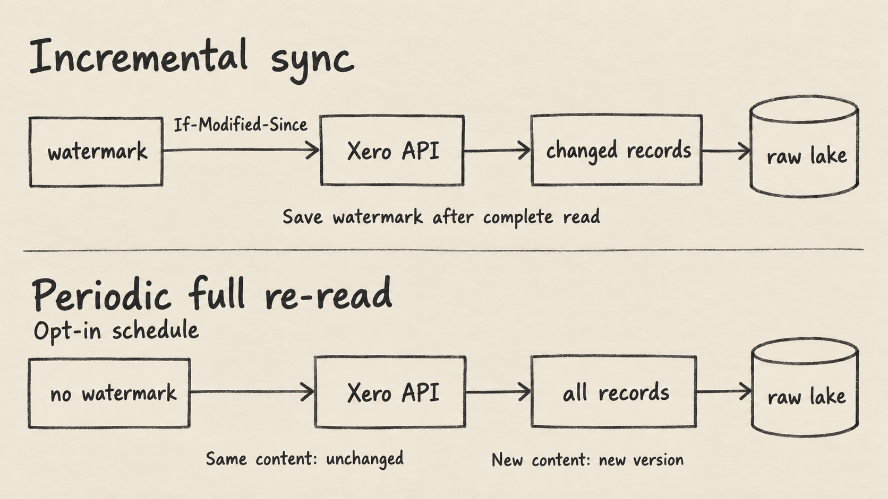

A Xero integration for analytics needs to preserve what the API returned, track what each sync actually read, and make accounting data available for SQL. Undercroft connects through OAuth, reads Xero with a YAML connector, lands records in an immutable raw data lake, and projects them into Postgres. Your dbt models turn that raw data into tables for reports.

This gives engineering and finance teams a repeatable Xero to Postgres pipeline with control over the reporting schema. It also leaves important decisions with those teams: which entities to read, how often to refresh them, and how to define business metrics. [Undercroft is open-source](https://github.com/muitneliss/undercroft), under the MIT license, and its README currently labels it pre-alpha.

## How does the Xero integration move data into Postgres?

The path is Xero API → connector → S3/MinIO raw lake → `raw.records` in Postgres → dbt → reports. OAuth authorizes access before the worker reads the selected organisation. The connector declares endpoints, authentication, pagination, retry behavior and incremental filtering in `specs/connectors/xero.yaml`.

The lake receives records before Postgres does. Its create-only writer stores content by hash: repeating the latest identical content returns `unchanged`; different content creates a new version. Existing versions are never overwritten in place. This preserves captured evidence when a source record changes later.

Postgres serves a different purpose. `raw.records` holds the newest observation of each record, with a JSONB payload and identifiers for its source, tenant, entity and source record. It is a rebuildable projection, while the lake is the durable layer. A SQL query over `raw.records` therefore reads current projected state, not the entire version history.

That separation lets you change a model without asking Xero for the same captured records again. Our [immutable raw data lake guide](/en/immutable-raw-data-lake/) explains the storage boundary, and the [ETL vs ELT comparison](/en/etl-vs-elt/) explains why transformation follows ingestion here.

## Which Xero API data can you sync?

The current connector declares 20 entity lists. Actual coverage depends on the entities selected for the connection and the read scopes its OAuth grant includes.

| Read scope                         | Entity lists in the connector                                                            |
| ---------------------------------- | ---------------------------------------------------------------------------------------- |
| `accounting.invoices.read`         | Invoices, credit notes, quotes, purchase orders, repeating invoices, linked transactions |
| `accounting.payments.read`         | Payments, overpayments, prepayments, batch payments                                      |
| `accounting.contacts.read`         | Contacts, contact groups                                                                 |
| `accounting.settings.read`         | Items, accounts, tracking categories, tax rates, currencies                              |
| `accounting.banktransactions.read` | Bank transactions, bank transfers                                                        |
| `accounting.manualjournals.read`   | Manual journals                                                                          |

“Journals” here means `/ManualJournals`. The connector does not declare the separate `/Journals` system journal endpoint. That distinction matters when deciding whether the captured documents cover the accounting question you want to answer.

Each entity has its own identifier, such as `InvoiceID` or `ContactID`. Pagination is also entity-specific: supported lists request `pageSize: "500"`, quotes and linked transactions use their endpoint's paging behavior, and unpaged lists explicitly disable pagination. Bank transfers request deleted entries, and tracking categories request archived entries.

For endpoints that accept it, the spec sends `unitdp: "4"` to request four-decimal unit amounts. It does not assume every endpoint accepts that parameter. These details are visible in the [Xero connector specification](https://github.com/muitneliss/undercroft/blob/main/specs/connectors/xero.yaml), so coverage can be reviewed before building a model around it.

## How do you connect Xero through OAuth?

Setup has two parts: the operator configures the deployment, then a tenant administrator authorizes an organisation. The [Xero setup runbook](https://github.com/muitneliss/undercroft/blob/main/docs/runbook/xero-setup.md) owns the detailed procedure.

1. Create a Xero OAuth web app and register the exact callback at `<UNDERCROFT_PUBLIC_URL>/oauth/xero/callback`.
2. Configure `UNDERCROFT_XERO_CLIENT_ID` and `UNDERCROFT_XERO_CLIENT_SECRET` on both the control plane and worker. Set `UNDERCROFT_PUBLIC_URL` to the browser-facing origin.
3. As a tenant admin, open Sources and choose **Connect Xero**. Complete the consent flow, select the organisation, and choose the entities to read.
4. Use **Run now** and inspect the Journal's per-entity counts and warnings before relying on downstream tables.

The selected Xero organisation ID is sent as `xero-tenant-id`. It is distinct from Undercroft's tenant ID. A connection without the provider's organisation ID is refused before reading data.

The worker seals credentials and refreshes tokens under a row lock, protecting refresh-token rotation from concurrent refreshes. A grant missing a required read scope leaves that entity unread and named in the Journal; other permitted lists continue. Reconnecting supplies newly requested consent. A run with no readable selected lists fails.

## How does incremental sync use a watermark?

For an entity with no usable watermark, the worker starts with a whole read, subject to its request budget. Later incremental reads send `If-Modified-Since` so Xero filters records on the server.

This is an excerpt of the actual invoice configuration, not a complete connector file:

```yaml
incremental:
  strategy: header
  header: If-Modified-Since
  sourcePath: UpdatedDateUTC
  format: ms-json-date
  send: rfc3339-seconds
```

Xero's `UpdatedDateUTC` text is stored as the watermark. Before sending it as a header, the runtime renders its instant as UTC RFC 3339, rounded down to the second. Rounding down can read some records again; identical content remains unchanged in the lake.

The watermark advances only after that entity's read completes. Taking the maximum timestamp from a partially loaded table would be unsafe: later pages could still contain older records. A separate projection cursor tracks how far the lake has been loaded into Postgres.

Watermarks also belong to the request used to obtain them. Changing the declared request invalidates the old match and causes a whole read. Entities without incremental configuration are read whole on each run.



## Why does Xero need a periodic full re-sync?

An incremental filter cannot reveal every edit. The repository documents cases where a due date or sent flag changes on a partially paid transaction without moving `UpdatedDateUTC`. Contact fields such as `Balances`, `IsSupplier` and `IsCustomer`, and an edited line's `AccountCode`, also motivate a whole re-read.

Undercroft provides a separate **Full re-sync** schedule per connection. It is **off by default**. Enable it on the source card when your reporting requirements need those edits captured. A due re-sync happens during a sync run, so pausing sync also stops scheduled re-sync work.

A whole re-read sends no watermark for that list. Unedited records land as unchanged; records with different content produce new versions. Its timing depends on the configured schedules and available request budget, so there is no universal daily freshness guarantee.

The current spec configures a 1,000-request day, with 800 available for whole reads and a 200-request reserve for ordinary change reads. It also sets 1,100 ms minimum spacing and observes `Retry-After`. These are repository configuration values to check against your app's limits, not a throughput promise.

If the whole-read budget is exhausted, a list may fall back to incremental reading or wait if it has no usable watermark. An interrupted whole read restarts from the beginning on a later run. The run can still succeed while its Journal records postponed work; success alone does not prove every list was fully refreshed.

## How do you turn a Xero data export into a data warehouse?

Treat ingestion and accounting definitions as separate responsibilities. The connector supplies source records. Your dbt models decide how invoice lines, payments, contacts and account codes become useful reporting tables. Undercroft ships no predefined invoice or customer business schema.

For example, a team building receivables reporting can define invoice grain, document statuses, payment treatment and currency handling in its own models. It should derive outstanding and overdue amounts from invoices rather than assume a contact's `Balances` snapshot answers the same question. Missing amounts remain missing; they must not silently become zero.

The worker builds tenant-authored dbt models into the tenant's analytics schema. Reports then query those built models using a read-only BI login. The BI role cannot directly read `raw`, which makes the model the explicit boundary between captured data and published metrics.

This is a foundation for a Xero data warehouse you define. A useful acceptance check is to compare entity coverage, record statuses and refresh evidence before comparing totals. A missing scope or postponed full read can explain a discrepancy that SQL alone cannot repair. The [Xero reporting with SQL and dbt guide](/en/xero-reporting-sql-dbt/) covers the modeling side of that workflow.

## FAQ

### Can I sync Xero to Postgres without a custom connector?

Yes. Undercroft ships a YAML Xero connector executed by its generic runtime; you configure OAuth and select the organisation and entities. You still write the dbt models that define your reporting tables.

### Does this Xero integration include every journal entry?

It includes the declared manual journals list when selection and consent allow it. It does not include the separate `/Journals` system journal endpoint, so do not equate manual journal coverage with a complete general ledger export.

### Is the Xero data export real-time?

It uses scheduled or manually triggered API reads. Incremental sync depends on Xero's change filter, while edits that filter misses require a whole re-read; the optional full re-sync schedule is off by default.

### Does a successful sync mean every entity is current?

No: permitted entities can complete while other lists are recorded as not granted or waiting for whole-read budget. Check the Journal, selected entities and last full-read evidence before treating a report as refreshed.
