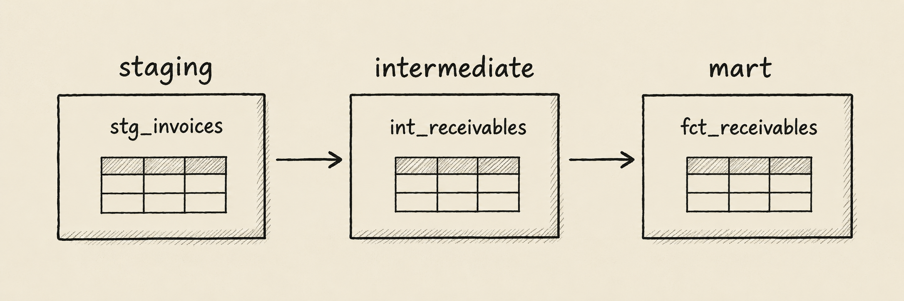

Báo cáo Xero tùy chỉnh thường bắt đầu từ một câu hỏi của finance: khoản phải thu nào đã quá hạn, chi phí thuộc nhóm nào, tiền thực nhận trong kỳ là bao nhiêu? Để trả lời bằng SQL, đội kỹ thuật cần thống nhất cách tính với người đọc trước khi chọn biểu đồ. Một dashboard đẹp vẫn có thể sai nếu cộng trùng invoice hoặc biến số tiền thiếu thành 0.

[Undercroft](https://github.com/muitneliss/undercroft) là data platform open-source: raw data vào data lake bất biến, records được đưa vào Postgres, rồi dbt chạy model do bạn viết. BI nằm trong mục Reports. Sản phẩm đang ở giai đoạn pre-alpha, không có sẵn business schema hay bộ báo cáo tài chính Xero; các model dưới đây là hướng thiết kế để đội bạn tự xây.

## Báo cáo Xero bằng SQL và dbt bắt đầu từ đâu?

Luồng dữ liệu đi từ Xero tới raw data lake trên S3 hoặc MinIO, sau đó vào `raw.records`, qua dbt model và đến BI. Raw data là lớp được giữ bền vững; dữ liệu trong Postgres là projection có thể dựng lại. Bạn có thể sửa logic report mà không phải coi cách diễn giải đầu tiên là cố định.

Connector khai báo invoices, payments, credit notes, accounts, tracking categories, bank transactions, bank transfers và manual journals. Tuy nhiên, danh sách connector hỗ trợ không đồng nghĩa tenant đã có đủ dữ liệu. Cần kiểm tra scope được cấp và kết quả đọc từng nguồn trước khi viết model.

Nếu chưa có dữ liệu, xem [cách tích hợp Xero vào Postgres](/tich-hop-xero-postgres/). Bài [phân biệt ETL và ELT](/etl-va-elt-la-gi/) giải thích vì sao có thể để bước xây model sau bước đưa raw data vào hệ thống.

## Cần thống nhất gì trước khi viết model?

Trước tiên, mô tả một dòng trong bảng có nghĩa gì: một invoice, một invoice line hay một khách hàng trong tháng? Đây là grain của model. Nếu nối tổng invoice với nhiều line rồi cộng lại, SQL vẫn chạy nhưng tổng có thể bị nhân lên.

| Nhu cầu          | Dữ liệu cần kiểm tra                                                      | Quy tắc phải thống nhất                        |
| ---------------- | ------------------------------------------------------------------------- | ---------------------------------------------- |
| P&L quản trị     | Invoice lines, accounts, credit notes, bank transactions, manual journals | Kỳ, nhóm tài khoản, dấu và điều chỉnh          |
| Công nợ phải thu | Invoices, contacts, payments, credit notes                                | Ngày chốt, số dư, nhóm quá hạn                 |
| Dòng tiền        | Payments, bank transactions, bank transfers                               | Ngày phát sinh, phạm vi tài khoản, chống trùng |

Đây là điểm bắt đầu, chưa chứng minh report đầy đủ. Connector có manual journals nhưng không đọc `/Journals`, tức system journal. Vì vậy, cần kiểm tra phạm vi dữ liệu trước khi gọi một P&L dựa trên chứng từ là kết quả đầy đủ từ sổ cái.

Mỗi số tiền cũng cần đi cùng currency. Chỉ quy đổi khi model có bước xử lý rõ ràng với tỷ giá gắn ngày; không cộng các currency khác nhau vào một tổng mặc định.

## Nên chia dbt model thành những lớp nào?

Staging đọc và chuẩn hóa từng entity; intermediate chứa phép tính dùng lại; mart cung cấp bảng cho report. Các tên trong hình là ví dụ tự xây, không phải model được Undercroft cài sẵn.



Ở `stg_invoices`, chọn source và entity, giữ ID, rồi lấy những field đã kiểm tra trong payload. Dùng `source()` để đọc raw records, `ref()` để đọc model phía trước. Bộ kiểm tra model từ chối tham chiếu trực tiếp tên bảng vì dbt sẽ không biết dependency.

`int_receivables` có thể tính số dư và nhóm quá hạn theo quy tắc đã thống nhất. `fct_receivables` cung cấp một dòng mỗi invoice cho dashboard. Không nối thêm line chỉ để lấy một nhãn nếu việc đó làm thay đổi grain.

SQL sau chỉ minh họa, giả định bạn đã tự tạo `int_receivables` với các cột tương ứng, một dòng mỗi invoice và `amount_due` dùng fixed precision. Đây không phải model có sẵn để chạy ngay.

```sql
select
    currency,
    ageing_bucket,
    count(*) as invoice_count,
    count(*) filter (where amount_due is null) as missing_amounts,
    sum(amount_due) as known_amount_due
from {{ ref('int_receivables') }}
group by currency, ageing_bucket
```

`sum` vẫn cộng các giá trị đọc được khi một số dòng là `NULL`. Vì thế, `known_amount_due` chỉ là tổng phần đã biết. Đặt `missing_amounts` bên cạnh để người đọc thấy giới hạn; đội finance cần quyết định có hiển thị tổng khi nhóm còn thiếu dữ liệu hay không.

## Số tiền thiếu khác số 0 như thế nào?

Undercroft giữ số tiền dưới dạng string ở các boundary, tính bằng `big.js` và dùng `numeric(18,4)` trong Postgres. Không đưa số tiền qua JavaScript `Number()` hoặc `parseFloat()`. Cách này giữ phép tính decimal trong độ chính xác đã quy định, nhưng không khôi phục được phần đã mất ở nguồn.

Trong dbt, dùng macro `parse_amount` do `models.reference` cung cấp. Giá trị không đọc được trở thành `NULL`, không phải 0. Viết `coalesce(amount, 0)` ở model sẽ xóa mất sự khác biệt giữa “không có bằng chứng” và “đã xác định bằng không”.

Hàm `formatMoney` hiển thị giá trị thiếu bằng dấu gạch ngang dài. Phần hiển thị cắt về hai chữ số thập phân, còn giá trị lưu giữ riêng. Report tùy chỉnh vẫn phải bảo toàn ý nghĩa này từ SQL đến cách trình bày.

Khi đối chiếu, kết quả có ba trạng thái: `ok`, `mismatch`, `unverified`. Thiếu một bên hoặc khác currency không đủ cơ sở kết luận khớp. Một bảng không có dòng báo lệch chưa chứng minh rằng mọi dòng đã được kiểm tra.

## Làm sao xây P&L và công nợ phải thu đáng tin cậy?

Với P&L quản trị, thống nhất kỳ, cách nhóm tài khoản và xử lý từng loại giao dịch trước. Tài khoản chưa được gán nhóm cần xuất hiện trong phần cần rà soát; loại bỏ âm thầm sẽ khiến report trông đầy đủ hơn dữ liệu thực tế.

Giữ ID nguồn để lần lại các records tạo nên kết quả. Đối chiếu một kỳ và một currency với bảng tham chiếu của finance, rồi giải thích chênh lệch theo nhóm. Decimal chính xác không tự sửa được mapping tài khoản hay chọn sai kỳ.

Với công nợ, hỏi rõ cần số dư hiện tại hay số dư tại một ngày trong quá khứ. Số dư invoice hôm nay không đủ để suy ra cuối tháng trước. Report lịch sử cần bằng chứng về thay đổi và logic tái dựng; raw data lake không tự tạo snapshot công nợ.

Nhóm quá hạn phải dùng ngày chốt đã thống nhất. Invoice thiếu ngày đến hạn nên nằm trong nhóm riêng, không tự xếp vào chưa quá hạn. Kiểm tra các mốc: đến hạn hôm nay, quá hạn một ngày và ngày đầu của từng nhóm tiếp theo.

## Xero dashboard về dòng tiền cần tránh lỗi gì?

Hãy xây model dòng tiền riêng. Ngày invoice, ngày payment và ngày bank transaction trả lời các câu hỏi khác nhau. Cần xem records thực tế trước khi quyết định ngày nào chi phối một dòng tiền.

Connector có payments, bank transactions và bank transfers, nhưng model vẫn phải xác định quan hệ giữa chúng để tránh cộng trùng. Tách chuyển tiền nội bộ khỏi thu chi bên ngoài, đồng thời ghi rõ report bao gồm những tài khoản nào.

Với connection cũ, kiểm tra scope cho dữ liệu ngân hàng và manual journals. Reconnect có thể bổ sung quyền đọc; một run thành công riêng lẻ chưa chứng minh đã thu thập đủ đầu vào cho model.

## Kiểm tra model và đưa lên Xero BI như thế nào?

Model-builder skill yêu cầu brief trước SQL và đọc mẫu từ data lake thay vì đoán payload. Quy trình gồm:

1. Thống nhất mục đích, grain, nguồn, cột, filter và tên model.
2. Đọc `lake.summary`, lấy mẫu qua `lake.records`, xem model và macro hiện có.
3. Chạy `models.check`, sửa error, trình bày warning và phần chưa xác minh.
4. Xin đồng ý với model cụ thể trước khi save; xin đồng ý build riêng.
5. Xem kết quả build, preview và dòng lỗi trước khi dùng cho report.

Test theo cột hỗ trợ `unique` và `not_null`. Test thất bại không ngăn bảng được tạo; các dòng vi phạm có thể đọc qua `dq.failures`. Những test này giúp kiểm tra grain và trường bắt buộc, chưa xác nhận nghiệp vụ tài chính đúng.

Tenant có thể sở hữu dbt macro để dùng chung một biểu thức giữa nhiều model. Admin viết macro qua CLI hoặc MCP; web UI chỉ hiển thị trong phần reference. Cần kiểm tra kỹ vì một macro lỗi có thể làm cả build của tenant thất bại.

Sau build, Reports lưu question bằng SQL hoặc visual editor và ghép chúng vào dashboard có filter chung. Question chạy bằng read-only login của tenant trên analytics schema. Nên đặt chỉ số thiếu dữ liệu cạnh biểu đồ tiền để người đọc biết giới hạn của kết quả.

## Câu hỏi thường gặp

### Undercroft có sẵn báo cáo tài chính Xero không?

Không có sẵn business schema hoặc bộ report tài chính. Đội của bạn tự viết model và thống nhất định nghĩa P&L, công nợ, dòng tiền.

### Có dùng SQL để tạo Xero dashboard được không?

Có, Reports hỗ trợ question viết bằng SQL trên model đã build. Dashboard sắp xếp các question đã lưu thành từng tile.

### Số tiền Xero bị thiếu có thành 0 không?

Amount parser trả về `NULL` khi không đọc được, còn money formatter hiển thị dấu gạch ngang dài. SQL tùy chỉnh cần giữ sự khác biệt đó và nêu rõ tổng chưa đầy đủ.

### AI agent có thể viết Xero dbt model không?

Model-builder skill hướng dẫn AI agent qua brief, đọc dữ liệu và kiểm tra model bằng MCP hoặc CLI. Save và build cần người dùng đồng ý cùng quyền phù hợp; bản SQL nháp chưa phải kết quả đã build thành công.
