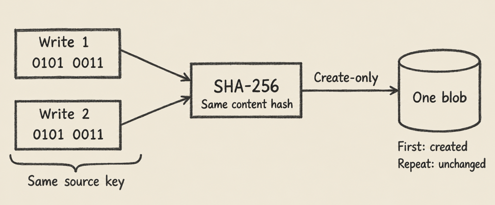

Một raw data lake hữu ích khi đội kỹ thuật cần sửa cách tính mà vẫn giữ được dữ liệu đã nhận. Đội tài chính và vận hành cũng cần điều đó: số trên dashboard thay đổi thì phải còn căn cứ để đối chiếu. Undercroft lưu raw data bất biến trên S3/MinIO, rồi tạo các projection trong Postgres và dbt model từ dữ liệu đã giữ lại.

Nếu nguồn đã sửa hoặc xóa nội dung, gọi API lần nữa chưa chắc lấy lại được phiên bản cũ. Vì vậy, raw data lake là lớp dữ liệu bền vững duy nhất trong kiến trúc này. Các lớp phía trên có thể dựng lại; dữ liệu chưa từng thu thập thì không thể tự khôi phục.

## Data lake là gì, và raw data lake giữ những gì?

Data lake lưu dữ liệu đầu vào trước khi nó được tổ chức theo một schema phục vụ report cụ thể. Trong Undercroft, lake giữ các byte được đưa vào đường ghi cùng manifest mô tả lần quan sát: source key, run, thời điểm và content hash.

Hai phần này trả lời hai câu hỏi khác nhau. Blob cho biết nội dung là gì. Manifest cho biết nội dung ấy được ghi nhận từ đâu, vào lúc nào. Cùng một tài liệu xuất hiện ở nhiều nơi có thể dùng chung blob nhưng vẫn có các lần quan sát riêng.

Raw data ở đây là phần pipeline thực sự thu thập, không phải toàn bộ lịch sử của ứng dụng nguồn. Connector chưa đọc một trường hay một phiên bản thì lake không có nó. Bài về [data integration qua REST API](/data-integration-la-gi-rest-api/) giải thích phần đưa dữ liệu vào hệ thống.

## Vì sao phải lưu dữ liệu gốc trước khi làm report?

Giả sử nhóm vận hành đổi quy tắc phân loại hồ sơ trễ hạn. Nếu raw data vẫn còn các trường cần thiết, kỹ sư có thể sửa SQL trong dbt model rồi tính lại. Đây là thay đổi cách diễn giải dữ liệu, không cần quay về nguồn để xin lại đầu vào.

Nếu hệ thống chỉ giữ tổng theo tháng và bỏ các bản ghi tạo nên tổng đó, việc sửa sẽ khó hơn. Khi nguồn cũng đã thay đổi, tổng cũ không đủ để tìm ra từng thành phần. Một dashboard đẹp không giải quyết được phần thông tin đã mất.

Undercroft đặt ranh giới tại đây: thông tin cần giữ phải vào raw trước. “Bền vững” chỉ lớp cần được bảo toàn để dựng lại các projection; nó không có nghĩa bucket tự miễn nhiễm với mọi sự cố hạ tầng.

## Content hash giúp tránh ghi trùng như thế nào?

`LakeStore` tính SHA-256 từ byte đầu vào và dùng digest làm địa chỉ blob. Đây là hàm tạo key thực tế trong `packages/lake/src/keys.ts`:

```typescript
export function blobKey(digest: string): string {
  return `_blobs/${digest.slice(0, 2)}/${digest}`;
}
```

Quy trình ghi có bốn bước chính:

1. Kiểm tra source key và tính hash của nội dung.
2. So sánh với digest của lần quan sát mới nhất tại source key đó.
3. Nếu giống nhau, trả `unchanged`, không ghi thêm blob hay manifest.
4. Nếu khác, tạo blob khi chưa có rồi tạo manifest mới. Ghi đè một lần quan sát đã tồn tại sẽ báo lỗi.



Đây là create-only kết hợp idempotent theo nội dung. Cùng byte nhưng đến từ source key khác vẫn có thể tạo manifest riêng và dùng lại blob. Nếu nội dung chuyển từ A sang B rồi trở về A, lần trở về cũng là một quan sát mới.

Content hash so sánh byte, không đánh giá ý nghĩa. Hai tài liệu nhìn giống nhau chưa chắc có cùng hash. Khi đọc một quan sát, store tính lại hash và báo lỗi nếu không khớp manifest.

## Data lake và data warehouse khác nhau ở đâu?

Data lake giữ đầu vào; data warehouse tổ chức dữ liệu để phân tích. Với Undercroft, Postgres và dbt model do người dùng viết đảm nhiệm phần phía sau. Platform không áp sẵn schema nghiệp vụ cho từng doanh nghiệp.

| Lớp                          | Vai trò                        | Căn cứ để dựng lại                    |
| ---------------------------- | ------------------------------ | ------------------------------------- |
| Raw lake trên S3/MinIO       | Giữ byte và manifest           | Phải bảo toàn các object này          |
| `raw.records` trong Postgres | Projection để truy vấn bản ghi | Các quan sát còn trong lake và loader |
| dbt model                    | Định nghĩa nghiệp vụ bằng SQL  | Model và dữ liệu đầu vào              |
| Kết quả dashboard            | Trình bày dữ liệu đã xử lý     | Projection và định nghĩa report       |

Tên `raw.records` không biến Postgres thành nơi lưu trữ gốc. Các bản ghi nguồn vào một bảng chung, payload là `jsonb`, được phân biệt bằng source, tenant, entity và source record ID.

Platform không tạo sẵn bảng khách hàng hay hóa đơn. Cách tổ chức nghiệp vụ thuộc dbt project của bạn; bài [làm report Xero bằng SQL và dbt](/bao-cao-xero-sql-dbt/) trình bày hướng sử dụng đó.

## Dùng chung blob có làm mất dấu vết tài liệu không?

Không nên gộp lịch sử xuất hiện chỉ vì nội dung giống nhau. Chẳng hạn, một attachment có mặt trong nhiều email: byte chỉ cần một blob, nhưng từng email mang attachment ấy vẫn là một sự kiện cần phân biệt.

Catalogue `raw.documents` giữ các lần xuất hiện riêng theo nguồn gốc. Nhiều dòng có thể cùng tham chiếu một digest. Vì thế, số document và số blob khác nhau là bình thường, không tự động có nghĩa pipeline bị lỗi.

Phần extraction tái sử dụng kết quả cho cùng byte trong phạm vi một tenant và một source. Nó không chia sẻ extracted text giữa các tenant hoặc giữa các source khác nhau. Lake hiển thị số document bên cạnh số blob riêng biệt và tính tổng byte theo blob riêng biệt, tránh cộng nhiều lần cùng nội dung.

## Sync bị ngắt thì phần đã đọc có còn không?

Điểm quyết định là dữ liệu đã được ghi xuống lake hay còn nằm trong bộ nhớ. Undercroft đọc theo stream, ghi từng chunk và cập nhật projection theo chunk. Không cần đợi đọc hết một nguồn mới bắt đầu lưu bền vững.

Lần chạy sau có thể đưa phần lake đã giữ vào Postgres và dùng các bản ghi đang có để tránh đọc lại không cần thiết. Journal của lake giúp loader đi tiếp qua các quan sát mới bằng cursor.

Tuy nhiên, dựng lại projection vẫn tốn công. `raw.records` còn giúp nhận biết dữ liệu đã lấy; xóa nó có thể khiến sync tiếp theo phải đọc nguồn với chi phí như lần đầu. “Có thể dựng lại” không đồng nghĩa “không tốn thời gian hay API request”.

## Retention có mâu thuẫn với immutable data không?

Create-only cấm âm thầm thay thế quan sát đã có. Retention quyết định quan sát nào còn được giữ. Hai quy tắc này khác nhau và cần được mô tả rõ khi lập chính sách lưu trữ dữ liệu gốc.

Mặc định hiện tại của `LakeStore` là giữ mọi quan sát. Khi cấu hình giới hạn, retention là số quan sát tối đa cho từng source key, tối thiểu một. Store xóa các quan sát cũ vượt giới hạn và trả về stamp đã xóa; kết quả ghi có trường `pruned`.

Đó là retention có giới hạn và có báo cáo. Nó không phải chính sách tự xóa sau một số ngày hay giới hạn tổng dung lượng. Ghi lại nội dung mới nhất không đổi không tạo thêm quan sát, nên các lần sync lặp không đẩy phiên bản thật ra khỏi giới hạn đếm.

Pruning cũng không xóa shared blob, vì source key khác có thể vẫn tham chiếu nó. Garbage collection cho blob là quyết định riêng; giảm số quan sát chưa chắc làm dung lượng blob giảm ngay.

## Có thể dùng S3 hoặc MinIO self-hosted không?

Có. Adapter hỗ trợ S3 và endpoint tương thích S3 như MinIO. Quy tắc content-addressed, create-only và retention nằm trong `LakeStore`, áp dụng cho cả hai cách lưu trữ.

Theo ADR 0050, compose trong repo dùng community build `pgsty/minio` và `pgsty/mc`, được pin bằng release tag. Đây là chi tiết cần biết khi xem xét triển khai self-hosted và bảo toàn volume chứa raw data qua các lần nâng cấp.

Bạn có thể đọc quyết định và implementation tại [repo open-source Undercroft](https://github.com/muitneliss/undercroft). Điều cần giữ xuyên suốt là byte và manifest, vì đó là căn cứ để dựng lại các lớp dữ liệu phía trên.

## Câu hỏi thường gặp

### Raw data lake có phải bản sao của Postgres không?

Không. Trong Undercroft, Postgres chứa projection từ lake, còn lake giữ cả byte của tài liệu. Chỉ sao chép bảng truy vấn không giữ được toàn bộ phần đầu vào ấy.

### Ghi cùng dữ liệu hai lần có tốn hai blob không?

Nếu byte giống quan sát mới nhất tại cùng source key, store trả `unchanged` và không ghi gì. Các source key khác nhau có thể dùng chung blob nhưng giữ manifest riêng.

### Có tìm raw data bằng tiếng Việt không dấu được không?

Có, Lake search dành cho admin hỗ trợ tìm không phân biệt dấu tiếng Việt trên giá trị bản ghi và extracted text. Kết quả trích đoạn giữ tiếng Việt của nguồn; mỗi giá trị được tìm trong tối đa 200.000 ký tự đầu.

### Raw data lake bất biến có giữ dữ liệu mãi mãi không?

Mặc định hiện tại giữ mọi quan sát, nhưng có thể cấu hình giới hạn số lượng. Khi đó pruning báo các quan sát đã xóa và không tự động xóa shared blob.
