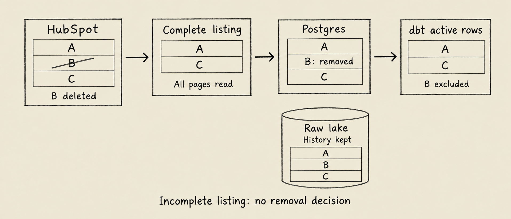

Tích hợp HubSpot với dữ liệu kế toán giúp đội sales, finance và ops trả lời câu hỏi chung: khách hàng có deal đã chốt thực sự mang lại bao nhiêu doanh thu? Undercroft đọc contacts, companies, deals và custom properties qua HubSpot API, lưu vào raw data lake rồi đưa sang Postgres. Từ đó, bạn viết dbt model để kết hợp CRM với Xero theo định nghĩa của doanh nghiệp.

Phần cần làm rõ ngay từ đầu là cách nhận diện khách hàng giữa hai hệ thống. Sync thành công chưa chứng minh một company trong HubSpot chính là một contact trong Xero. Undercroft cung cấp data pipeline; quy tắc ghép khách hàng và tính doanh thu thuộc về model của bạn.

## Tích hợp HubSpot sang Postgres hoạt động như thế nào?

Dữ liệu đi theo đường HubSpot API → connector → raw data lake → Postgres → dbt. Connector HubSpot được mô tả bằng YAML: endpoint, quyền truy cập, pagination, properties và cách dùng watermark. Một runtime chung thực thi cấu hình đó.

Raw data đi qua cùng một đường ghi create-only vào data lake. Postgres giữ projection để truy vấn bằng SQL; các phiên bản đã ghi vẫn nằm trong lake. Nhờ vậy, khi đổi cách tính một chỉ tiêu, bạn có thể sửa model mà không phải xem bảng của dashboard là bản dữ liệu duy nhất.

Undercroft là data platform open-source, không cung cấp sẵn schema nghiệp vụ cho từng doanh nghiệp. Dữ liệu CRM vào lớp chung `raw.records`; dbt model do bạn viết mới tạo ra các bảng phục vụ BI. Có thể xem connector trong [repository Undercroft](https://github.com/muitneliss/undercroft), hoặc đọc thêm về [raw data lake bất biến](/raw-data-lake-bat-bien/) và [data integration bằng REST API connector](/data-integration-la-gi-rest-api/).

## Connector đọc những dữ liệu CRM nào?

Contacts, companies và deals là ba nhóm chính. Connector còn đọc dữ liệu commerce, owners, pipelines và các association được khai báo. Mỗi nhóm phụ thuộc vào scope của private app.

| Nhóm dữ liệu                 | Nội dung tiêu biểu                     | Dùng trong model           |
| ---------------------------- | -------------------------------------- | -------------------------- |
| Contacts                     | Tên, email, company, owner ID          | Phân tích ở cấp contact    |
| Companies                    | Tên, domain, industry, lifecycle stage | Nhóm khách hàng CRM        |
| Deals                        | Stage, pipeline, amount, close date    | Theo dõi pipeline bán hàng |
| Quotes, line items, products | Các object riêng                       | Chi tiết thương mại        |
| Owners, deal pipelines       | Owner và các stage                     | Hiển thị nhãn dễ hiểu      |
| Associations                 | Liên kết object, kèm kind và label     | Join theo quan hệ nguồn    |

Đừng dùng trường company dạng text của contact để thay cho association. Connector đọc các liên kết như deal–company và contact–company, giúp model dựa vào quan hệ nguồn thay vì đoán từ tên.

Association cũng không có timestamp thay đổi trong response này. Vì thế, `source_updated_at` của association là NULL. Gán thời gian đọc hoặc timestamp của deal vào đây sẽ tạo ra một thời điểm có vẻ hợp lý nhưng không đúng ý nghĩa.

## Kết nối HubSpot API và chọn custom properties ra sao?

HubSpot dùng private-app token, không có màn hình OAuth consent trong luồng kết nối này. Admin của HubSpot tạo token; admin của tenant trong Undercroft thêm token vào Sources.

1. Tạo private app trong HubSpot và cấp các read scope cần thiết. Ba scope chính là `crm.objects.contacts.read`, `crm.objects.companies.read` và `crm.objects.deals.read`.
2. Trong Sources, chọn HubSpot rồi dán token. Worker thử đọc một company để kiểm tra trước khi lưu credential đã được mã hóa.
3. Mở **Change what syncs** để chọn thêm properties, bao gồm custom properties của portal.
4. Bấm **Run now**, rồi xem từng entity trong Journal để biết dữ liệu nào thực sự đã được đọc.

Danh sách properties mặc định luôn được giữ lại. Bạn chỉ thêm, không bỏ bớt các trường bắt buộc của connector. Sáu object có thể chọn thêm properties là companies, contacts, deals, quotes, line items và products; owners, pipelines và associations không có lựa chọn này.

Khi chọn thêm properties, request list lấy ID và thông tin pagination, sau đó batch read lấy tập properties đầy đủ qua POST body. Cách này tránh nhét toàn bộ tên properties vào URL. Chọn custom properties không đồng nghĩa connector hỗ trợ mọi custom object.

Nếu thiếu scope, Journal nêu rõ list không được đọc và scope cần bổ sung; các list được cấp quyền vẫn tiếp tục. Khi không đọc được list nào, run thất bại. Vì vậy, hãy kiểm tra Journal trước khi kết luận dữ liệu trống nghĩa là không có giao dịch.

## Incremental sync có giảm số record phải đọc không?

Với contacts, companies và deals, incremental sync dùng client-side filter. Mỗi run vẫn đi qua toàn bộ live listing; watermark quyết định payload nào cần ghi vào lake. Record không đổi vẫn được tính là đã xuất hiện, dù payload của nó bị bỏ qua ở bước ghi.

Do đó, một portal ít thay đổi vẫn có thể cần nhiều request. Tiết kiệm lượt ghi không đồng nghĩa chỉ gọi API cho record mới. Connector dùng object listing endpoint, không dùng search endpoint có giới hạn số kết quả trên mỗi query.

Cấu hình hiện tại đặt mức 100 request mỗi phút và retry một số lỗi tạm thời, gồm 429, có tôn trọng `Retry-After`. Đây là cấu hình connector, không phải cam kết quota của mọi tài khoản HubSpot. HubSpot cũng không có mục full re-sync riêng trong Undercroft vì mỗi run đã đọc toàn bộ listing.

## Record bị xóa trong HubSpot có biến mất khỏi report không?

Có, nếu model lọc trạng thái removed và đã có một listing đầy đủ đủ điều kiện. Khi record từng được lưu không còn xuất hiện trong live listing, Undercroft đánh dấu `deleted_at` ở Postgres. Model lọc record đó ra khỏi tập dữ liệu đang hoạt động.



Run lỗi, dừng giữa chừng hoặc bị cắt ngắn không đủ bằng chứng để kết luận record đã mất. Listing trống cũng không khiến toàn bộ dữ liệu bị đánh dấu removed. Đây là điểm cần hiểu khi kiểm tra vì sao một lần sync chưa làm số lượng record giảm.

Removal không xóa payload cuối cùng hay các phiên bản trong lake. `deleted_at` là lúc Undercroft nhận thấy record vắng mặt, không phải giờ xóa chính xác trong HubSpot. Nếu record được khôi phục và xuất hiện trong listing đầy đủ sau đó, trạng thái removed được gỡ ngay cả khi payload không đổi.

Các association được khai báo phụ thuộc parent sẽ được đánh dấu removed hoặc khôi phục theo parent. Properties `hs_merged_object_ids` trên contacts, companies và deals cung cấp thêm thông tin để model xử lý identity sau merge.

Vẫn có độ trễ: record bị xóa sau bước list nhưng trước batch read có thể chỉ được nhận diện ở run đầy đủ tiếp theo. Khi rebuild projection trong Postgres, các record cũng trở lại trạng thái live cho đến khi một listing đầy đủ xác định lại removal.

## Kết hợp HubSpot với Xero bằng dbt cần chuẩn bị gì?

Trước tiên, hãy thống nhất một mapping đã kiểm tra giữa HubSpot company ID và Xero contact ID. Không tự động coi hai tên gần giống nhau là cùng khách hàng. Record chưa ghép được cần xuất hiện trong danh sách cần xử lý, thay vì biến mất khỏi quá trình đối chiếu.

Tiếp theo là định nghĩa doanh thu. Deal amount, tổng invoice và tiền đã thu trả lời những câu hỏi khác nhau. Model cần quy định status được tính, cách xử lý credit, ngày ghi nhận và currency. Chỉ quy đổi tiền tệ khi có quy tắc cùng tỷ giá theo ngày rõ ràng.

SQL dưới đây chỉ minh họa cấu trúc join. Hai model được tham chiếu là model bạn tự viết, không phải bảng có sẵn trong Undercroft; `net_revenue` cần dùng kiểu decimal và tuân theo định nghĩa đã thống nhất.

```sql
select
  m.hubspot_company_id,
  r.currency,
  sum(r.net_revenue) as revenue
from {{ ref('customer_mapping') }} as m
join {{ ref('xero_revenue') }} as r
  on r.xero_contact_id = m.xero_contact_id
group by m.hubspot_company_id, r.currency
```

Hãy kiểm tra mapping không nhân bản dòng kế toán. Inner join này chỉ lấy khách hàng đã có mapping, nên cần report riêng cho ID chưa ghép được. Giá trị tiền thiếu hoặc không đọc được phải khác với số không. Bài [tích hợp Xero sang Postgres](/tich-hop-xero-postgres/) trình bày nguồn kế toán; bài [report Xero bằng SQL và dbt](/bao-cao-xero-sql-dbt/) đi sâu hơn vào model.

Cần kiểm tra độ mới của cả hai nguồn. Một số thay đổi trong Xero không làm timestamp mà change filter sử dụng thay đổi. Full re-sync của Xero mặc định tắt, phải bật theo connection, chạy trong sync run và chịu daily request budget. Run có thể thành công dù Journal báo một số list đang chờ budget; không nên mặc định CRM và kế toán luôn cùng thời điểm quan sát.

## Câu hỏi thường gặp

### Có sync HubSpot custom properties sang Postgres được không?

Có, chọn thêm properties trong **Change what syncs** cho sáu object được hỗ trợ. dbt model của bạn quyết định cách đưa những giá trị đó thành cột phục vụ truy vấn.

### Tích hợp HubSpot có cập nhật real-time không?

Dữ liệu được đọc theo lịch sync hoặc khi bấm **Run now**. Độ mới phụ thuộc lịch và thời gian hoàn thành, không có cam kết mọi chỉnh sửa xuất hiện tức thì.

### Xóa contact trong HubSpot có xóa raw data không?

Không, listing đầy đủ đủ điều kiện chỉ giúp đánh dấu removed trong Postgres; payload và lịch sử lake vẫn được giữ. Model phải lọc removal nếu chỉ muốn hiển thị record còn hoạt động.

### Undercroft có sẵn model doanh thu HubSpot–Xero không?

Undercroft cung cấp đường đưa raw data vào Postgres và cho phép bạn viết dbt model. Mapping khách hàng, định nghĩa doanh thu và cách xử lý currency cần được thiết kế cho doanh nghiệp của bạn.
