# Architecture

This page is the map of the whole system: which processes run, what each owns, how data moves
between them, and who is allowed to touch what. It explains how the parts fit together and
names the decision behind each part. It does not repeat those decisions. Why a thing is so
lives in its ADR under [`adr/`](adr/), how to operate it lives in its runbook under
[`runbook/`](runbook/), and the conventions for changing the code live in
[`CLAUDE.md`](../CLAUDE.md) and `.claude/rules/`.

## Contents

1. [The idea in one picture](#the-idea-in-one-picture)
2. [Three rules the architecture follows](#three-rules-the-architecture-follows)
3. [System context](#system-context)
4. [Runtime topology](#runtime-topology)
5. [Code structure](#code-structure)
6. [Data architecture](#data-architecture)
7. [Key flows](#key-flows)
8. [Security model](#security-model)
9. [Scheduling](#scheduling)
10. [Observability](#observability)
11. [Build, release and deploy](#build-release-and-deploy)
12. [Where to read next](#where-to-read-next)

## The idea in one picture

Undercroft is a generic data platform. It pulls from any REST source into an immutable raw lake,
projects the lake into one generic Postgres table, and lets each tenant write its own dbt models
and reports on top. It ships no business schema: a `customers` table belongs in a tenant's dbt
project, never in this repository
([ADR 0002](adr/0002-one-generic-raw-table-no-business-schema.md)).

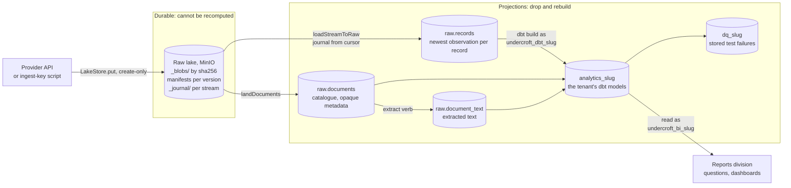

`slug` stands for the tenant's slug: each tenant has its own schemas and its own database
logins.

## Three rules the architecture follows

Each of these rules shapes a boundary you will find in the code.

| Rule                                         | Where it shows in the architecture                                                                                                                                                                                                               | Decision                                                                                                                        |
| -------------------------------------------- | ------------------------------------------------------------------------------------------------------------------------------------------------------------------------------------------------------------------------------------------------ | ------------------------------------------------------------------------------------------------------------------------------- |
| **Raw is the only durable layer.**           | The lake is create-only and content-addressed. Everything in Postgres, from `raw.records` up, can be dropped and rebuilt from it.                                                                                                                | [0001](adr/0001-raw-lake-is-the-only-durable-layer.md)                                                                          |
| **Never guess; return nothing and say why.** | A read that fails raises instead of yielding an empty stream. A record the pipeline refuses is recorded with its reason. Money is a string and an unreadable amount is `null`, never `0`. A run that stopped early never advances its watermark. | [0006](adr/0006-money-and-time-in-typescript.md), [0021](adr/0021-run-evidence-is-a-ledger-not-a-log-stream.md)                 |
| **One writer, many callers.**                | Every byte enters through `LakeStore`'s create-only path, which only the worker imports. The lake write API, a scheduled sync and a Gmail harvest are all callers of that one path.                                                              | [0004](adr/0004-declarative-connectors-and-the-lake-write-api.md), [0015](adr/0015-a-first-party-collector-for-byte-sources.md) |

The same one-door idea applies to people and agents. The web UI, the CLI, MCP clients and the
assistant all reach the platform through the same tRPC procedures and the same role gates. No
caller gets a private back door.

## System context

Who and what talks to Undercroft from the outside:

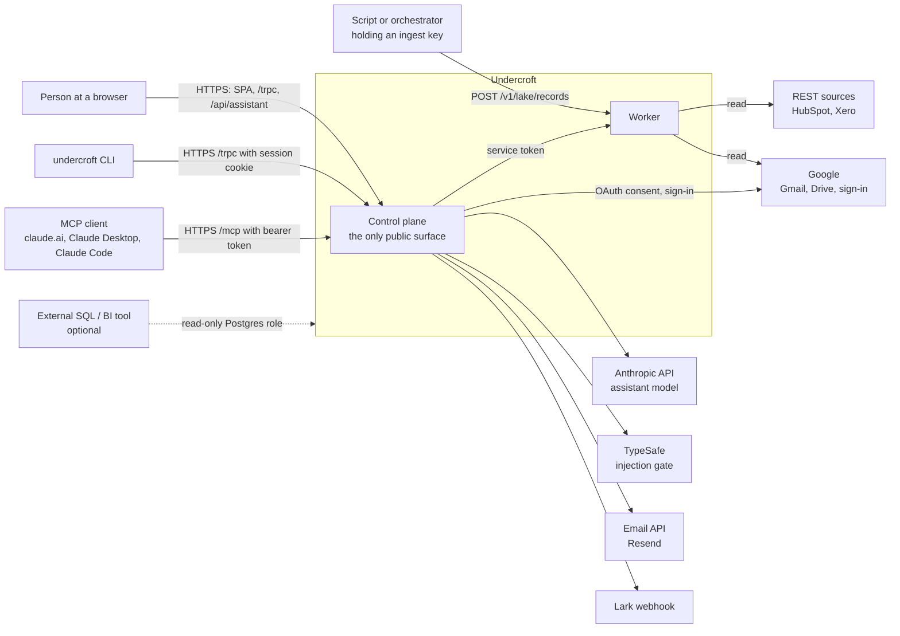

- **People** use the web UI. Sign-in is invite-only, through Google or an emailed one-time code
  ([ADR 0010](adr/0010-invite-only-sign-in-with-better-auth.md)).
- **The CLI** sends every router procedure to `/trpc` with the person's own session cookie
  ([ADR 0044](adr/0044-an-agent-reaches-undercroft-as-a-caller.md)).
- **MCP clients** call `/mcp` with a personal access token or an OAuth access token
  ([ADR 0060](adr/0060-an-agent-reaches-undercroft-over-mcp.md),
  [ADR 0061](adr/0061-an-mcp-client-signs-its-person-in-and-draws-two-widgets.md)).
- **Scripts** land records through the worker's lake write API with a per-tenant ingest key. On
  the production stack the worker publishes no port, so such a caller runs inside the compose
  network.
- **Providers** are read by the worker only. The control plane talks to Google and Xero only to
  run sign-in and the consent handshake.

## Runtime topology

One Docker Compose project, `undercroft`, deployed as a single Dokploy stack
([ADR 0008](adr/0008-deploy-on-release-from-ci.md),
[ADR 0049](adr/0049-dokploy-clones-the-compose-file-from-main.md)). The files are
`deploy/compose/docker-compose.yml` for local development and
`deploy/compose/docker-compose.server.yml` for the server.

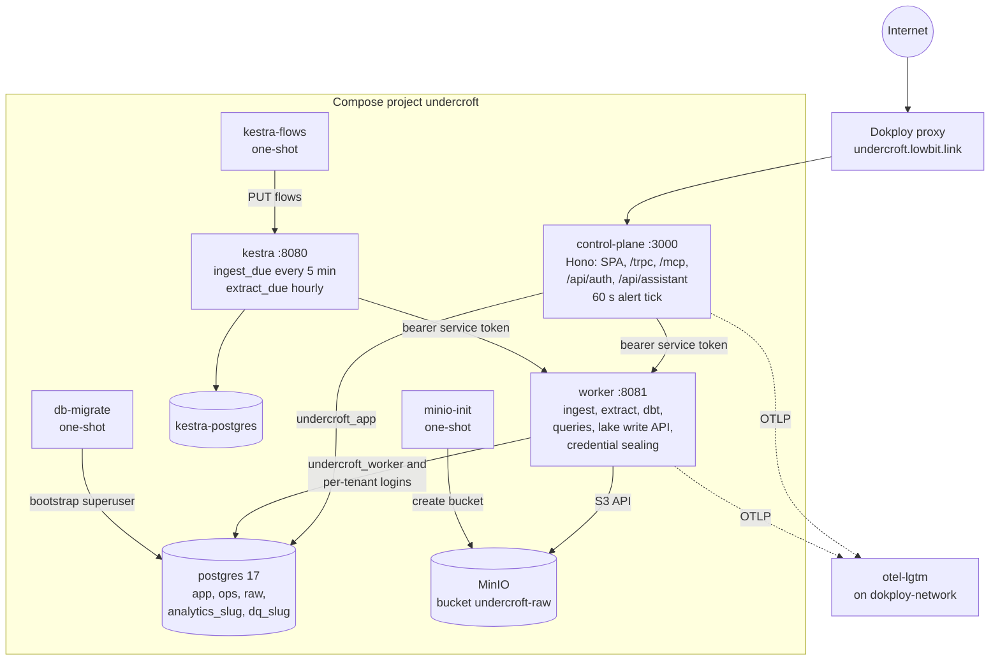

| Service           | Image                                                                                                | Owns                                                                                                                                               | Memory |
| ----------------- | ---------------------------------------------------------------------------------------------------- | -------------------------------------------------------------------------------------------------------------------------------------------------- | ------ |
| `control-plane`   | `deploy/Dockerfile.control-plane`                                                                    | The public surface: the SPA, `/trpc`, `/mcp`, sign-in and OAuth, the assistant, and the alert tick. Holds no sealing key and never reads the lake. | 512m   |
| `worker`          | `deploy/Dockerfile.worker`, with dbt, poppler and Tesseract                                          | Everything that touches data: ingest, extract, dbt, customer-written SQL, the lake write API, and sealing and unsealing credentials.               | 3g     |
| `kestra`          | `kestra/kestra`                                                                                      | The clock. Two flows ask the worker what is due and start it. It holds no business logic.                                                          | 2g     |
| `postgres`        | `postgres:17-alpine`                                                                                 | Control-plane state, the run ledger, the raw projection, and each tenant's models.                                                                 | 1g     |
| `minio`           | `pgsty/minio` community build ([ADR 0050](adr/0050-the-raw-lake-runs-a-community-build-of-minio.md)) | The raw lake.                                                                                                                                      | 1g     |
| `kestra-postgres` | `postgres:17-alpine`                                                                                 | Kestra's own repository and queue.                                                                                                                 | 512m   |
| `db-migrate`      | control-plane image, one-shot                                                                        | Applies `packages/db/sql` as the bootstrap superuser and sets the platform roles' passwords.                                                       | 256m   |
| `kestra-flows`    | control-plane image, one-shot                                                                        | Pushes `flows/*.yml` into Kestra on every deploy.                                                                                                  | 128m   |
| `minio-init`      | `pgsty/mc`, one-shot                                                                                 | Creates the `undercroft-raw` bucket and, on the server, denies anonymous access.                                                                   | 128m   |

Every service declares a memory limit, and `task ci:compose-check` fails the build when one
does not. Only the control plane is reachable from the internet, through Dokploy's proxy.

### The control plane's HTTP surface

Routes are registered in `apps/control-plane/src/handlers/server.ts`, in this order. The order
matters, because the SPA catch-all comes last.

| Route                                                    | What it serves                                                                                                                                      |
| -------------------------------------------------------- | --------------------------------------------------------------------------------------------------------------------------------------------------- |
| `GET /api/health`                                        | Liveness, used by the deploy smoke test                                                                                                             |
| `ALL /api/auth/*`, `ALL /.well-known/*`                  | Better Auth: sessions, the email code, Google sign-in, and the OAuth authorization server for MCP                                                   |
| `GET /oauth/:provider/callback`                          | Where Google or Xero sends an admin back after consenting a connection                                                                              |
| `ALL /trpc/*`                                            | `appRouter`, cookie session only. Used by the SPA and the CLI.                                                                                      |
| `POST /api/assistant/chat`, `GET /api/assistant/history` | The assistant ([ADR 0029](adr/0029-the-assistant-is-an-interleaf.md))                                                                               |
| `ALL /mcp`                                               | Stateless MCP server, bearer only                                                                                                                   |
| `GET /*`                                                 | The SPA. A missing `/assets/` file is a 404, never `index.html` ([ADR 0070](adr/0070-a-tab-a-deploy-left-behind-reloads-when-it-loses-nothing.md)). |

### The worker's HTTP surface

The worker (`apps/worker/src/server.ts`) listens on port 8081 inside the compose network. Every
route needs `Authorization: Bearer <UNDERCROFT_TRIGGER_TOKEN>`, the service token. The lake write
API also accepts a tenant's ingest key.

| Route                                                    | Caller                     | Does                                                                             |
| -------------------------------------------------------- | -------------------------- | -------------------------------------------------------------------------------- |
| `GET /v1/runs/due`, `GET /v1/runs/extract-due`           | Kestra                     | Lists the tenant and source pairs that are due                                   |
| `POST /v1/runs/ingest`                                   | Kestra, control plane      | Starts an ingest and answers 202. By default a transform runs after it succeeds. |
| `POST /v1/runs/extract`                                  | Kestra                     | Reads text out of landed documents                                               |
| `POST /v1/runs/transform`                                | tooling                    | Runs `dbt build` for one tenant                                                  |
| `POST /v1/models/build`, `POST /v1/dq/failures`          | control plane              | Builds one model; returns a failed test's stored rows                            |
| `POST /v1/queries/run`, `/schema`                        | control plane              | Runs report SQL as the tenant's BI login                                         |
| `POST /v1/queries/raw/run`, `/raw/schema`, `/raw/search` | control plane              | Runs Lake Console SQL and lake search as the tenant's dbt login                  |
| `POST /v1/connections/credential`, `/browse`, `/revoke`  | control plane              | Seals a consented credential, browses a provider, revokes a grant                |
| `POST /v1/lake/records`                                  | scripts with an ingest key | The lake write API                                                               |
| `GET /v1/runs/:id`, `GET /health`                        | anyone with the token      | A run's state; liveness                                                          |

Jobs run inside the worker process. There is no separate queue. On `SIGTERM` the worker stops
running jobs at a safe point and drains for up to 45 seconds, inside the 60 second grace period
compose gives it ([ADR 0051](adr/0051-a-deploy-stops-a-run-at-a-safe-point-and-the-run-keeps-its-counts.md)).

## Code structure

A Bun workspace, TypeScript only
([ADR 0003](adr/0003-typescript-monorepo-on-bun-with-trpc.md)). dbt is Python, but it is an
invoked dependency inside the worker image, like Postgres. The repository never imports it.

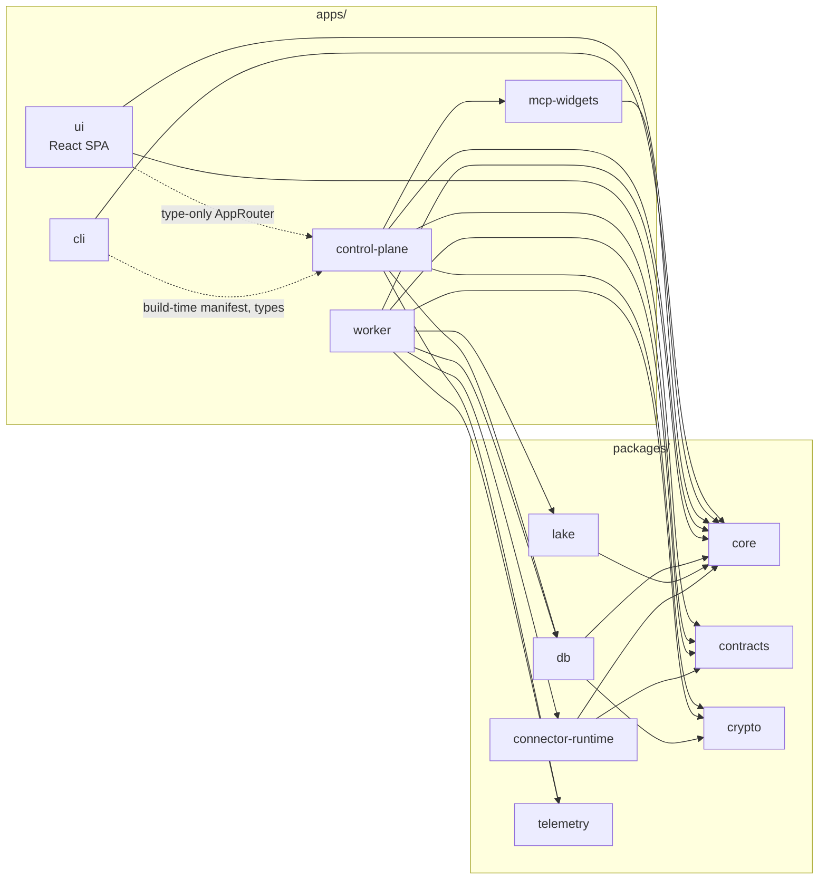

Dotted arrows are type-only or build-time dependencies. They carry no code into the bundle.

| Unit                         | Purpose                                                                                                                                                        |
| ---------------------------- | -------------------------------------------------------------------------------------------------------------------------------------------------------------- |
| `apps/control-plane`         | The composition root for the public surface: Hono server, tRPC `appRouter`, Better Auth, MCP, the assistant, and alerts                                        |
| `apps/worker`                | The data plane: runs, the lake write API, extraction, dbt, query execution, and credential sealing                                                             |
| `apps/ui`                    | React 19 SPA on Vite. Server state lives in tRPC and React Query, client state in one Zustand store ([ADR 0009](adr/0009-ui-state-in-zustand-no-usestate.md)). |
| `apps/cli`                   | The `undercroft` CLI. One command per router procedure, generated from the router's manifest at build time.                                                    |
| `apps/mcp-widgets`           | The two widgets an MCP client draws: a result grid and a live run                                                                                              |
| `packages/core`              | Money (`big.js`), lossless JSON, clock, locale, email, Lark, logging, retry and pacing. No internal dependencies.                                              |
| `packages/contracts`         | Zod contracts shared across the boundary: connector spec, lake API, runs, BI, cadence, models                                                                  |
| `packages/crypto`            | AES-256-GCM seal and unseal, token digests, PKCE                                                                                                               |
| `packages/db`                | The `SqlExecutor` seam, pool, migrations (`sql/`), and shared repos and services                                                                               |
| `packages/lake`              | `LakeStore`: the create-only, content-addressed store over S3 or memory                                                                                        |
| `packages/connector-runtime` | Runs a YAML connector spec: auth, paging, pacing, retry, incremental reads                                                                                     |
| `packages/telemetry`         | OpenTelemetry traces and logs, and the `x-trace-id` middleware                                                                                                 |

Only the worker imports `lake` and `connector-runtime`. The control plane imports `crypto` only
for token digests, never to seal. The CLI is kept a pure HTTP caller by the `cli-no-backdoor`
ast-grep rule.

### Layers inside a service

Backend code runs in one direction: handler, then service, then repo
([ADR 0011](adr/0011-layers-handler-service-repo.md), `.claude/rules/layering.md`). A file's
directory is its layer.

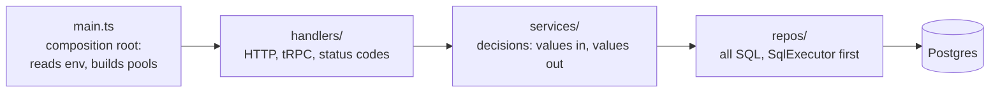

SQL appears only in repos, and every dependency is passed in. The `layer-*` ast-grep rules fail
the gate when code crosses a layer in the wrong direction.

## Data architecture

### The raw lake

`packages/lake` is the only writer of lake bytes. `LakeStore.put` behaves the same way for every
caller:

1. If the newest version at the key has the same SHA-256, it returns `unchanged` and writes
   nothing.
2. Otherwise it writes the blob only if the blob is absent, which deduplicates by content.
3. It creates a new manifest for the version. If the object already exists it raises
   `ObjectExists` rather than overwrite.
4. When the caller names a stream, it appends a journal pointer.

| Key                                             | Holds                                                 |
| ----------------------------------------------- | ----------------------------------------------------- |
| `_blobs/{sha[0:2]}/{sha}`                       | The bytes, stored once per distinct content           |
| `{sourceKey}/{stamp}/manifest.json`             | One version of one record or document                 |
| `_journal/{stream}/{stamp}/{sha[0:12]}`         | The per-stream log a projection reads from its cursor |
| `records/{source}/{tenant}/{entity}/{recordId}` | A record's source key                                 |
| `documents/{source}/{tenant}/{documentId}`      | A document's source key                               |

Retention is unbounded by default. `prune()` reports what it removed and never deletes a blob.
Names that a person wrote, such as a filename, a subject or a folder, go in the manifest's
`extra`. dbt and BI cannot reach the manifest. They never go in Postgres (`.claude/rules/pii.md`).

### Postgres

Migrations are numbered files in `packages/db/sql/`, applied in order and recorded in
`ops.schema_migration`. Definitions that are restated on every deploy live in `sql/repeatable/`
([ADR 0036](adr/0036-a-definition-is-restated-not-migrated.md)).

| Schema           | Holds                                                                                                                                                                                   | Written by              |
| ---------------- | --------------------------------------------------------------------------------------------------------------------------------------------------------------------------------------- | ----------------------- |
| `app`            | People and auth (`auth_*`, `app_user`, `tenant_member`), invitations, sealed secrets, ingest keys, models, BI questions and dashboards, assistant threads, access tokens, OAuth clients | control plane, worker   |
| `ops`            | Tenants, connections (scope, cadence, cron), the run ledger (`run`, `run_entity`, `run_refusal`, `run_step`, `run_event`), the audit log, `tenant_role`                                 | control plane, worker   |
| `raw`            | `records` (partitioned by source), `documents`, `document_text`, `load_cursor`, `sync_cursor`, and the search functions                                                                 | worker                  |
| `analytics_slug` | One tenant's built dbt models                                                                                                                                                           | that tenant's dbt login |
| `dq_slug`        | That tenant's stored test failures                                                                                                                                                      | that tenant's dbt login |

Two cursors keep reads proportional to new work:

- **`raw.load_cursor`** records how far the projection from the lake into `raw.records` has got.
  It advances per batch of 500 ([ADR 0033](adr/0033-an-ingest-streams-and-does-not-re-read-what-it-holds.md)).
- **`raw.sync_cursor`** holds a provider watermark per tenant, source and entity. It is keyed on
  the request exactly as it was sent, so a changed request triggers a full read
  ([ADR 0034](adr/0034-the-watermark-is-a-table-not-a-max.md),
  [ADR 0072](adr/0072-a-watermark-is-keyed-on-the-request-as-sent.md)).

### Sources

| Kind                       | Sources       | How it is read                                                                                                                                                                                                                                                                                                                                                 |
| -------------------------- | ------------- | -------------------------------------------------------------------------------------------------------------------------------------------------------------------------------------------------------------------------------------------------------------------------------------------------------------------------------------------------------------- |
| Declarative REST connector | HubSpot, Xero | A YAML spec in `specs/connectors/`, validated against `specs/schema/connector.v1.json` and run by `packages/connector-runtime` ([ADR 0004](adr/0004-declarative-connectors-and-the-lake-write-api.md)). A new REST source needs no migration.                                                                                                                  |
| First-party byte collector | Gmail, Drive  | Code in `apps/worker/src/services/google/`, because a spec cannot describe bytes ([ADR 0015](adr/0015-a-first-party-collector-for-byte-sources.md)). Files are recognised by type first, and a signed record is verified before it is read ([ADR 0048](adr/0048-a-file-is-recognised-by-its-type-first-and-a-signed-record-is-verified-before-it-is-read.md)). |
| Pushed records             | anything      | `POST /v1/lake/records` with an ingest key                                                                                                                                                                                                                                                                                                                     |

A spec declares its auth (`none`, `bearer` or `oauth2`), its paging, pacing, retry, incremental
strategy, guards such as `failOnEmpty`, and whether a record missing from a complete listing
counts as removed ([ADR 0071](adr/0071-a-record-a-complete-listing-no-longer-names-is-removed-at-source.md)).
When the grant lacks a scope a list needs, that list is recorded as not granted and the other
lists are still read ([ADR 0073](adr/0073-a-list-its-grant-cannot-read-is-named-not-failed.md)).
Any other failure raises.

### Documents and extracted text

A document's bytes land in the lake and its catalogue row lands in `raw.documents`, which holds
only opaque ids, types and counts. The extract verb reads each distinct digest once and writes
`raw.document_text`, giving either a method or a reason it could not read. PDFs go through
`pdftotext`. Scans and images go through `pdftoppm` and Tesseract (`vie+eng`). `.docx`, `.xlsx`
and legacy `.doc` are read in process. The full list is in
[the file-format reference](reference/file-formats.md). Raising the reader version offers every
unread document again ([ADR 0024](adr/0024-extracted-text-is-readable-by-dbt.md),
[ADR 0028](adr/0028-a-workbook-is-read-in-process-and-extract-is-scheduled-by-backlog.md)).

### Transform and reporting

A tenant's models are rows in `app.model`. For each build the worker renders a throwaway dbt
project with `raw.records` and `raw.documents` as sources, plus the macros it ships, such as
`parse_amount`. It then runs `dbt build` as a subprocess, connected as that tenant's dbt login
([ADR 0007](adr/0007-dbt-runs-as-a-subprocess-in-the-worker.md)). Models materialise as tables in
`analytics_slug`, and test failures are stored in `dq_slug`.

Reports are first-party ([ADR 0020](adr/0020-bi-is-first-party-metabase-leaves-the-stack.md)). A
question is a saved definition plus a chart. It compiles to SQL in which every identifier and
literal is quoted, and the worker runs that SQL as the tenant's BI login. Result rows are never
stored.

Full-text search covers record payloads and document text through two GIN expression indexes.
Text is folded, so Vietnamese matches with or without tone marks
([ADR 0026](adr/0026-full-text-search-over-the-raw-lake.md)).

## Key flows

### A scheduled ingest

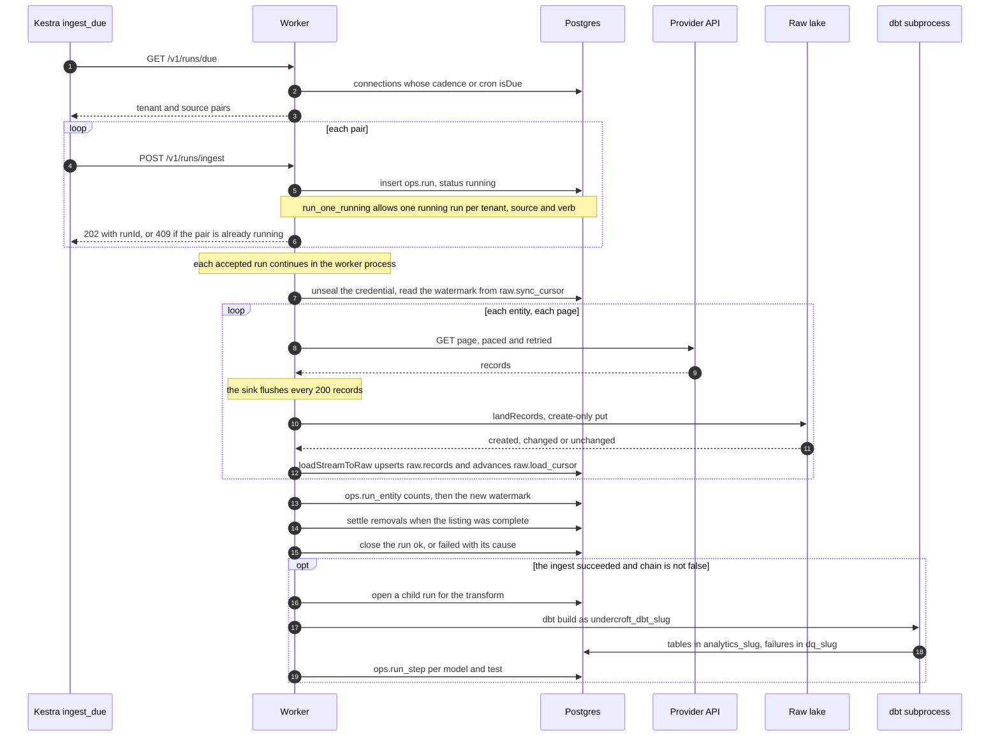

The counts are decided when the records are written to the lake, not when they are projected:
Landed = New + Changed + Unchanged ([the run-count reference](reference/run-counts.md)). Because
each chunk is projected as soon as it lands, a run that dies part-way leaves `raw.records`
holding everything it landed. The next run skips those records instead of reading them again. If
an ingest fails, no transform is chained, so the previous tables keep serving. They are stale
rather than wrong.

Every run moves through the same small set of states:

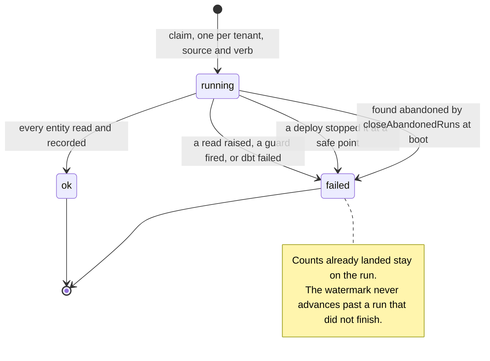

The ledger (`ops.run`, `run_entity`, `run_refusal`, `run_step`, `run_event`) is evidence, not a
log stream ([ADR 0021](adr/0021-run-evidence-is-a-ledger-not-a-log-stream.md)). Events come from
a fixed vocabulary, and a progress line is rewritten in place rather than appended
([ADR 0032](adr/0032-a-progress-line-is-a-gauge-not-an-entry.md)).

### Connecting a source

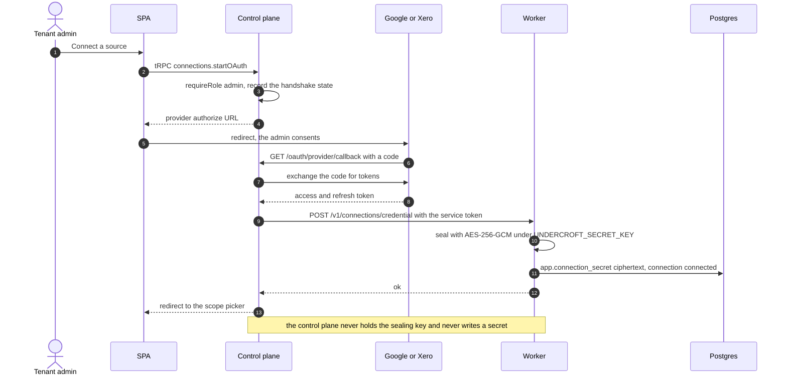

The worker seals and the control plane only consents
([ADR 0016](adr/0016-the-worker-seals-the-control-plane-consents.md)). HubSpot uses a private-app
token instead of OAuth. The admin pastes it through `connections.setToken`, and the worker proves
the token works before sealing it.

### Extracting document text

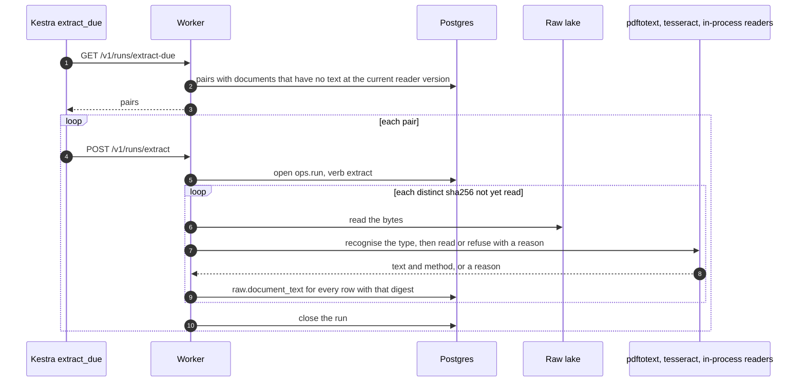

Extraction is scheduled by backlog, not by cadence: a pair is due when it has unread documents.

### Running a report

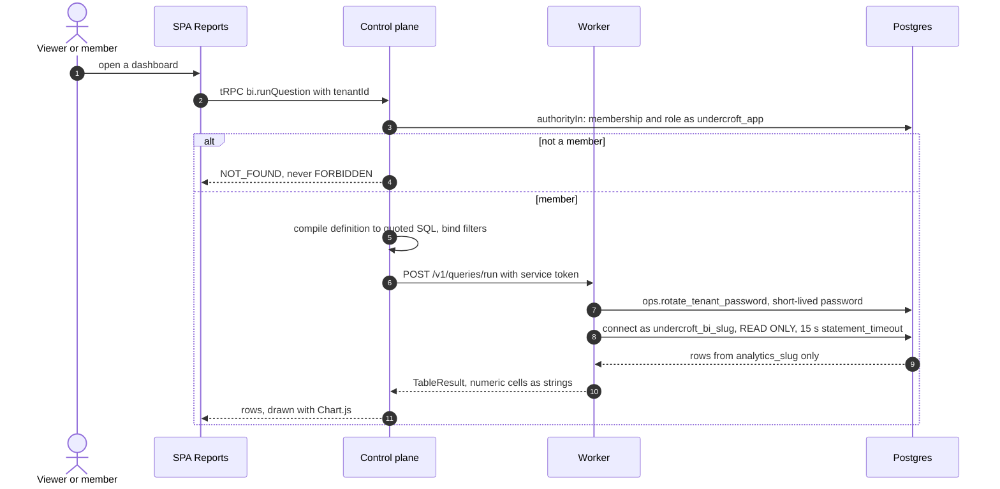

The Lake Console and lake search follow the same path, but the worker connects as the tenant's
dbt login, which can read `raw` under row-level security. Only an admin can use them.

### Pushing records through the lake write API

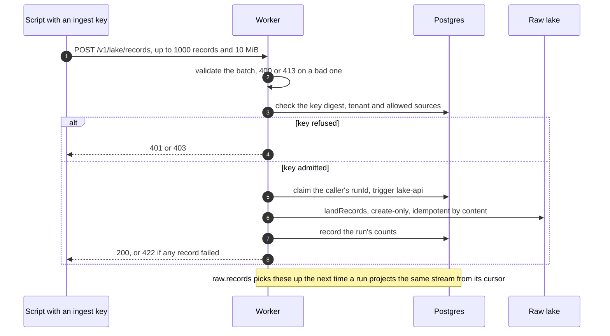

A batch with any failed record returns 422, never a 200 carrying a failed count.

### An agent over MCP

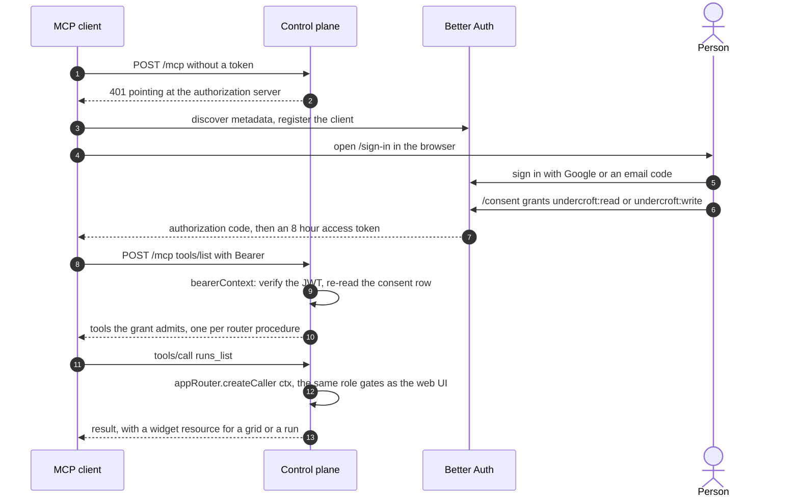

A personal access token minted on `/account` skips the sign-in dance and is checked the same way.
The consent is re-read on every call, so revoking the app stops it at its next request
([ADR 0062](adr/0062-a-refused-bearer-is-logged-and-an-access-token-lives-eight-hours.md)).
`/mcp` also serves the published `skills/` through the MCP Skills extension
([ADR 0067](adr/0067-the-published-skills-are-one-family-over-both-doors.md)).

### The assistant proposing a change

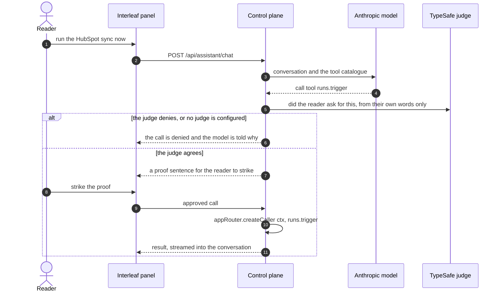

Tool results can contain text written by people outside the system, because the assistant reads
the raw lake. That is why the judge sees only what the reader said, never tool results, and why
an unconfigured judge denies rather than allows
([ADR 0029](adr/0029-the-assistant-is-an-interleaf.md)).

## Security model

### Doors and what each one admits

| Door                            | Credential                                     | Grant                                                                                | Reaches                               |
| ------------------------------- | ---------------------------------------------- | ------------------------------------------------------------------------------------ | ------------------------------------- |
| Web UI                          | Better Auth session cookie                     | always `write`                                                                       | `/trpc`, `/api/assistant`             |
| CLI                             | the same session cookie, stored with mode 0600 | `write`, but the CLI refuses writes until a person sets `allowWrites` on the profile | `/trpc`                               |
| MCP                             | personal access token, or OAuth access token   | `read` or `write`, chosen by the person                                              | `/mcp`, minus session-only procedures |
| Assistant                       | the reader's session                           | per tool: read, navigate, write, privileged                                          | `appRouter.createCaller`              |
| Kestra, control plane to worker | `UNDERCROFT_TRIGGER_TOKEN`                     | service                                                                              | the worker's `/v1/*`                  |
| Scripts                         | tenant ingest key, stored as a SHA-256 digest  | one tenant, optionally some sources                                                  | `POST /v1/lake/records` only          |

Every door into the router goes through the same base procedures in
`apps/control-plane/src/handlers/trpc.ts`:

- `grantAdmits` refuses a write to a read-only credential. It classifies procedures through
  `handlers/surface.ts`, and an unclassified mutation fails closed.
- `tenantProcedure` answers NOT_FOUND to a caller who is not a member of the tenant, so the API
  cannot be used to discover which tenants exist.
- `requireRole` answers FORBIDDEN once membership is established but the role is too low.
  Roles are `viewer`, then `member`, then `admin`. Superadmins are named in
  `UNDERCROFT_SUPERADMINS` and act as admin in every existing tenant
  ([ADR 0013](adr/0013-superadmins-named-in-the-environment.md)).
- `account.*` is session-only, so no token can mint another token.

### Database roles

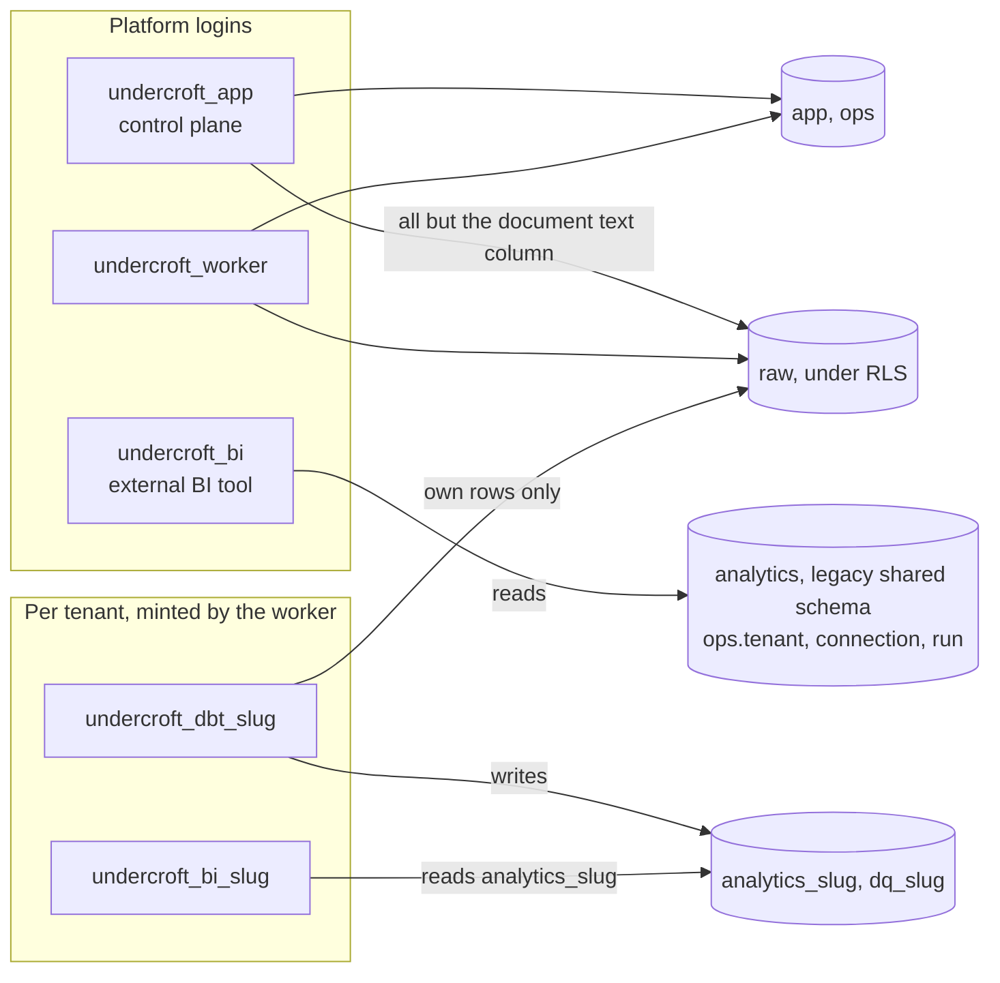

- Row-level security on `raw.records`, `raw.documents` and `raw.document_text` keys on
  `raw.tenant_of(current_user)`, that is, on which login is connected. It never keys on a
  session setting ([ADR 0018](adr/0018-per-tenant-roles-and-row-level-security.md)).
- Per-tenant passwords are short-lived. `ops.rotate_tenant_password` mints one for each session,
  only the worker may call it, and the password is never stored.
- The BI roles are revoked the whole `raw` schema, so the text a customer's documents contain
  reaches a dashboard only through a model that customer wrote
  ([ADR 0005](adr/0005-the-role-and-grant-model.md), `.claude/rules/privileges.md`). The
  platform `undercroft_bi` role, kept for an operator's external SQL client, reads only the legacy
  shared `analytics` schema and three `ops` tables. It cannot read a tenant's `analytics_slug`.
- The control plane scopes a request in application code, by passing `tenantId` explicitly
  after `tenantProcedure` has resolved the caller's authority. SQL a customer wrote never runs
  in the control plane.

### Secrets

Provider credentials are sealed with AES-256-GCM (`packages/crypto/src/seal.ts`). Each blob
records its key version, so the key can be rotated without resealing everything at once. Only the
worker holds `UNDERCROFT_SECRET_KEY`. `.env` files are never tracked, and `task ci:secrets-check`
enforces that.

## Scheduling

Kestra is only a clock. Both flows ask the worker what is due, so the schedule lives in
Postgres, where the control plane edits it.

| Flow                    | Trigger             | Does                                                                                         |
| ----------------------- | ------------------- | -------------------------------------------------------------------------------------------- |
| `flows/ingest_due.yml`  | every 5 minutes     | `GET /v1/runs/due`, then `POST /v1/runs/ingest` for each pair. A 409 does not fail the flow. |
| `flows/extract_due.yml` | hourly, at minute 7 | `GET /v1/runs/extract-due`, then `POST /v1/runs/extract` for each pair                       |

A connection's cadence is `hourly`, `every_6h`, `daily`, `paused` or a custom five-field cron
([ADR 0059](adr/0059-a-sync-may-run-on-a-cron-expression.md)). `isDue` in
`packages/contracts/src/cadence.ts` evaluates it in the Asia/Singapore time zone. A cron that
could fire more often than the 5 minute tick is refused.

The control plane runs its own 60 second tick for alerts. It emails a tenant's admins about a
failed run, a grant about to lapse, or an ingest key about to expire, each at most once. It can
also post failure and recovery cards to the operators' Lark group.

## Observability

`packages/telemetry` creates OpenTelemetry spans by hand, because Bun does not run the `require`
hooks that auto-instrumentation needs. It propagates W3C `traceparent` from the control plane to
the worker. Every response carries `x-trace-id`, every tRPC error carries `traceId`, and every
log line carries it too. When `OTEL_EXPORTER_OTLP_ENDPOINT` is set, traces and logs go to the
host's shared `otel-lgtm` stack ([ADR 0058](adr/0058-requests-are-traced-into-the-hosts-otel-lgtm.md)).
`task obs:*` follows an id through Tempo, Loki and the container log, and the `debug-trace`
skill drives it.

## Build, release and deploy

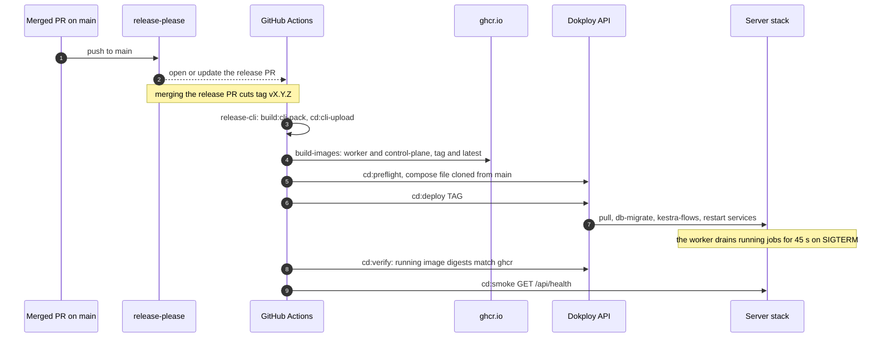

- **The gate.** Every pull request runs `task ci:verify`: typecheck, lint, the ast-grep rules,
  format check, spec validation, the SPA build and the test suite. It needs no Docker, no network
  and no credentials. `task ci:itest` is the Docker-backed tier and runs separately.
- **Only a release deploys.** Merging the release-please PR cuts a tag. The tag builds both
  images, attaches the packed CLI to the release, and deploys through the Dokploy API, which is
  the only channel for a change. SSH is read-only.
- **A deploy is verified.** `cd:verify` compares the running containers' image digests with the
  released images instead of trusting Dokploy's `done`.
- **Rollback** pins `IMAGE_TAG=vX.Y.Z` and redeploys, or runs `task cd:release TAG=vX.Y.Z`. The
  compose file does not roll back with the images, because the host always clones `main`'s copy
  ([deployment runbook](runbook/deployment.md), `.claude/rules/deployment.md`).

Every operation, local or in CI, goes through [Task](https://taskfile.dev)
([ADR 0023](adr/0023-task-is-the-mandatory-command-entrypoint.md)). `task --list-all` lists them
all.

## Where to read next

| To understand                          | Read                                                                                                                                                                                                                                                  |
| -------------------------------------- | ----------------------------------------------------------------------------------------------------------------------------------------------------------------------------------------------------------------------------------------------------- |
| Why the lake is the only durable layer | [0001](adr/0001-raw-lake-is-the-only-durable-layer.md), [0002](adr/0002-one-generic-raw-table-no-business-schema.md)                                                                                                                                  |
| How a connector spec works             | [0004](adr/0004-declarative-connectors-and-the-lake-write-api.md), `specs/schema/connector.v1.json`                                                                                                                                                   |
| How runs stream, resume and stop       | [0033](adr/0033-an-ingest-streams-and-does-not-re-read-what-it-holds.md), [0051](adr/0051-a-deploy-stops-a-run-at-a-safe-point-and-the-run-keeps-its-counts.md), [0056](adr/0056-a-drive-ingest-stops-within-one-file-and-a-cut-off-run-says-so.md)   |
| Tenancy, roles and grants              | [0005](adr/0005-the-role-and-grant-model.md), [0018](adr/0018-per-tenant-roles-and-row-level-security.md), `.claude/rules/privileges.md`                                                                                                              |
| How agents reach the platform          | [0029](adr/0029-the-assistant-is-an-interleaf.md), [0044](adr/0044-an-agent-reaches-undercroft-as-a-caller.md), [0060](adr/0060-an-agent-reaches-undercroft-over-mcp.md), [0061](adr/0061-an-mcp-client-signs-its-person-in-and-draws-two-widgets.md) |
| Operating the deployment               | [deployment runbook](runbook/deployment.md), [0008](adr/0008-deploy-on-release-from-ci.md), [0049](adr/0049-dokploy-clones-the-compose-file-from-main.md)                                                                                             |
| Working on the code                    | [`CLAUDE.md`](../CLAUDE.md) and `.claude/rules/`                                                                                                                                                                                                      |
