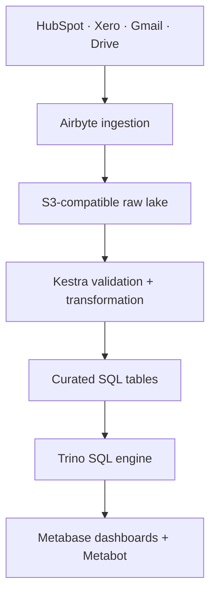

# Data platform implementation handoff for Claude Code

**Date:** 2026-09-17  
**Objective:** Build and deploy a working, maintainable pipeline from HubSpot, Xero, Gmail, and Google Drive into an object-storage data lake, with SQL queries, BI dashboards, and AI-assisted analytics. Use the available **Dokploy skill** for deployment of Dokploy-managed services. Deliver evidence from real end-to-end validation, not only a diagram or a running UI.

## 1. Instructions to the implementing agent

1. Read repository instructions, architecture, existing deployment/knowledge-base docs, and the current Git state. Reuse existing infrastructure, naming, secrets management, test practices, and environments where appropriate. Do not overwrite uncommitted work.
2. **Discover, read, and apply the `dokploy` skill before planning or executing deployment.** Use its actual installed name and instructions. Never invent skill commands or claim to have used a missing skill. If it is not installed, search the available skill registry/project skill files, document the blocker and complete all independent implementation and local verification. The requirement to use this skill applies to the services actually managed by Dokploy.
3. Verify all version-sensitive deployment and connector details against current official documentation and the deployed versions. Pin tested image versions or digests; document upgrade procedure. This handoff describes the required behavior, not a mandate to force a particular unsupported packaging method.
4. Make routine decisions independently. Request input only for indispensable external items such as Dokploy access, domains, OAuth administrator consent, production secrets, an actual Xero tenant, or a production deployment approval if not already authorized in the session. Finish everything possible before requesting access. Never commit secrets or real customer data.
5. Build a demonstrable local/staging path with seeded synthetic data when production credentials are unavailable. Record precisely what was verified locally versus with live connectors.

## 2. Scope and concrete outcome

**Sources:** HubSpot CRM objects (at least contacts, companies, deals), Xero accounting objects (at least contacts, invoices, payments), Gmail messages and metadata, and a selected Google Drive folder tree. Source permissions and selected streams should be configurable. **PDFs in Drive and Gmail attachments are required raw-lake inputs with different ingestion paths; implement and test both as described in §5.**

**Landing:** An immutable, source-separated `raw` area in S3 or an S3-compatible object store. Preserve source IDs, source tenant/mailbox, source timestamps, ingestion timestamp, connector run ID, and the original payload or original file where supported. Only authorized roles can access email bodies, accounting data, and documents.

**Curated:** Reproducible analytical tables for `customers`, `deals`, `invoices`, `payments`, `messages_metadata`, and `documents_metadata`. Define a source-ID crosswalk instead of assuming HubSpot contact ID equals Xero contact ID. A deterministic match (such as confirmed address or an explicit mapping) can be joined; ambiguous matches remain unlinked and appear in a review queue. Include source lineage on every row.

**Consumption:** Metabase connects to the SQL layer and includes an example cross-source dashboard: deals and invoiced/paid amounts by customer and period, with clear treatment of currencies and refunds. Its SQL editor works against curated tables. Metabot can answer questions about governed analytical tables with a configured AI provider; an AI-generated answer is never treated as authoritative without checking the underlying data/query. Full-text question answering over mail or documents is a **separate capability** from Metabot analytics and requires a dedicated ingestion/indexing/RAG pipeline if explicitly needed.

**Operations:** Scheduled runs, history and retry visibility, alerts on sync or transformation failures, backup and restore, least-privilege authentication, resource limits, documented recovery, and live smoke tests.

### Proposed topology

Choose one well-defined initial route from raw files to curated SQL tables:

- **Preferred for a real lakehouse:** Iceberg tables on S3-compatible storage with a supported catalog (for example a tested REST/JDBC catalog) and Trino. Implement idempotent merges/upserts, delete/reconciliation policy, compaction, and catalog backup. Airbyte's S3 Parquet files are **not automatically Iceberg tables**: write a separate load/registration step and validate the table metadata.
- **Lean starting route if hardware is limited:** Keep raw data in the lake and materialize small, curated reporting tables in Postgres; connect Metabase directly to Postgres. Document an explicit migration to Iceberg/Trino with a repeatable backfill. Do not deploy a resource-heavy distributed query cluster on a weak host just to match a diagram. The raw S3 data remains the lake in this route.

Record the chosen route and server resource measurements in an ADR. Ensure the production path is actually queryable from Metabase before calling the project complete.

## 3. Service ownership and deployment

| Service | Initial responsibility | Deployment decision |
| --- | --- | --- |
| Airbyte | Source authentication, extraction, cursor state, raw syncs | Current OSS deployment uses Kubernetes/`abctl`; **do not** invent an unsupported all-in-one Docker Compose stack. Assess a supported dedicated `abctl`/Kubernetes installation, existing Airbyte installation, or Airbyte Cloud. Document how Kestra reaches it and how it is backed up. |
| S3 or MinIO | Separate `raw`, `curated`, and optional `quarantine` buckets/prefixes | Prefer the organization's existing S3. If MinIO is needed, deploy via Dokploy skill with durable volumes, restricted internal access, bucket policies, backups, and a tested restore. |
| Kestra | Trigger Airbyte jobs, wait for completion, validate and load, emit results/alerts | Deploy via Dokploy skill with a durable metadata database, required plugins, health checks, and a single owner for schedules. |
| Trino + table catalog | Query curated Iceberg tables, if lakehouse route selected | Deploy only with adequate memory and a tested object-store/catalog integration. Prefer a small supported configuration first; document limits. |
| Metabase | SQL editor, datasets, dashboard, and Metabot | Deploy via Dokploy skill with an external persistent application database and restricted/authenticated access. Connect with a read-only SQL identity. |

Use Dokploy's current official deployment model for each service. For Compose services, place configuration in version control, validate `docker compose config`, use named volumes for durable state where applicable, set resource and health policies, and publish only necessary HTTPS endpoints. **Dokploy UI variables are not automatically injected into containers**: map each required variable explicitly or follow the documented `env_file` pattern. Keep service credentials in its supported secrets mechanism. Avoid brittle direct mounts from a transient Git checkout. Document restore and rollback, including application database and catalog state as well as object storage. Never expose S3/MinIO, SQL engines, or databases publicly without a documented access requirement.

Airbyte is intentionally an infrastructure boundary: installing it with its supported Kubernetes mechanism may fall outside Dokploy's application/Compose model. Use the Dokploy skill for Dokploy services and do not claim Airbyte itself was deployed with Dokploy if it was installed separately. A managed Airbyte option is acceptable when it meets the user's hosting/security requirements; record the reasoning and recurring cost.

## 4. Data contracts and pipelines

### Ingestion contract

- Declare source account/tenant and scope, selected streams or Drive folder, primary key, update cursor, expected cadence, backfill start, timezone, payload retention, and owner for each connection. Maintain this inventory in version control with secrets referenced indirectly.
- Run a bounded historical backfill and then incremental sync where supported. Keep raw data append-only with `source`, `tenant_id`, `entity`, `ingested_at`, `run_id`, and payload. Never mistake an appended update for the unique current record.
- Support replay from raw without calling the source again. Capture counts and high-water marks. Mark incomplete runs; downstream publishing must not silently treat partial data as complete.
- Separate regulated/sensitive content from general BI datasets. Respect deleted or revoked data according to the organization's retention policy, including raw objects, derivative tables, and AI indexes.

### Curated contract

- Normalize UTC timestamps, stable source IDs, currency codes and amounts using fixed-precision decimals, nulls, status transitions, and references between Xero invoices and payments. Separate transaction date, source update time, and ingestion time.
- Implement deterministic, idempotent current-state tables keyed by `(source, tenant_id, source_record_id)`. Retain raw history for replay. Specify how an update, duplicate, late record, and source delete affects curated state.
- Do not add invoiced and paid amounts as if they were separate revenue. Define dashboard metrics and invoice/credit/refund logic in one version-controlled semantic contract. Never sum mixed currencies without conversion policy and an effective-dated FX rate source; default to grouping by currency.
- Add quality checks for uniqueness, required IDs, referential links, reasonable row-count deviations, valid money types, and freshness. Quarantine malformed records with source/run context; do not log email bodies or tokens.
- Publish only a successful consistent generation to Metabase. Favor views/models that show the last successful run and its freshness.

### Orchestration sequence

1. Kestra starts or observes the Airbyte sync and waits for a terminal success state. Avoid overlapping runs for the same connection; retries use a unique run identifier.
2. Check raw manifest/object availability, counts and freshness. On failure, retain previous published curated generation and alert with a traceable run ID.
3. Normalize each source, apply dedup/upsert/reconciliation, run quality tests, then publish curated tables atomically when supported by the chosen storage engine.
4. Run a BI query smoke test and capture job metrics and lineage. Expose run status, duration, rows read/written/rejected, cursor and freshness by source.

## 5. Connector-specific decisions to verify

| Source | Initial scope | Required proof / known risk |
| --- | --- | --- |
| HubSpot | Contacts, companies, deals, associations required by reporting | Confirm private app/OAuth scopes, custom properties, updated-record behavior, API quotas, and deletion/archive semantics. |
| Xero | Contacts, invoices, payments, credits where needed | Confirm tenant ID, OAuth refresh, scopes, incremental cursor and rate limits. Airbyte currently labels this connector's sync success rate **Low**; run a real tenant pilot with reconciled counts/totals before production adoption. Investigate failures rather than accepting missing financial rows. |
| Gmail | Message metadata/body and PDF MIME attachments | Sync `messages_details` through Airbyte, then run the separate Gmail attachment worker described below. The stream is incremental by `internalDate`, but its parent listing still scans messages. Test mailbox quota and changes to existing messages/labels. A synced message is not evidence that its PDF attachment exists as an S3 file. |
| Drive | Selected folder subtree and original PDFs | Airbyte Google Drive `Copy raw files` → S3 destination with `**/*.pdf` and preserved subdirectories. The connector is scoped to one folder and recursively includes subfolders; configure additional sources for other roots. It does **not** replicate incremental deletes. Reconcile inventory and tombstones separately. |

Google OAuth access and service-account delegation must be checked against the actual Google Workspace policy and least-privilege scopes. Keep mail and Drive ACL provenance where required; do not expose a cross-user AI search until authorization is enforced at retrieval time.

### PDF ingestion into S3 raw: two distinct paths

**Google Drive PDF files (native Airbyte file copy):**

1. Configure the Google Drive source with an authorized folder link and an appropriate backfill start date. Add one or more file streams matching `**/*.pdf` relative to that root. Enable **Copy raw files** and **Preserve sub-directories**; send the file stream to the Airbyte **S3 destination**, using a dedicated raw bucket/prefix. Validate the precise delivery and sync options on the deployed connector version.
2. In raw-file mode, preserve the original PDF bytes rather than selecting **Document file type**, which emits extracted text as a record instead of a PDF file. If document text/OCR is needed, run a separate downstream extraction from the stored PDF; retain the source file for replay.
3. Verify the documented prerequisites: Airbyte OSS/Enterprise >= `1.2.0`, S3 destination >= `1.4.0`, maximum `1 GB` per file. Route larger files to a separately documented downloader. Do not assume a GCS destination has the same raw-file capability.
4. Preserve file identity with Drive file ID, modification/version information where exposed, original path, S3 object key, SHA-256, bytes, sync time and permissions metadata in a versioned manifest. Two PDFs named `invoice.pdf` in different folders must remain distinguishable. Record the exact behavior of changed files and bucket versioning. Keep an authoritative full inventory to detect removed files: incremental deletes are unsupported.

**Gmail PDF attachments (Airbyte metadata + explicit binary downloader):**

1. Sync `messages_details` **and its parent `messages` stream** into a restricted S3 raw-record prefix. Traverse each message's MIME payload recursively, including nested multipart messages. Determine PDF by MIME type and/or validated PDF signature, not filename extension alone; keep the original filename when available. An email containing a *Drive link* is not an attachment and is handled by the Drive path only if that file is within the authorized Drive scope.
2. Implement a small independent worker orchestrated by Kestra. For each candidate MIME part, decode `body.data` when the full attachment data is supplied inline; otherwise use its `attachmentId` with Gmail `users.messages.attachments.get`, then base64url-decode the returned data. Handle missing/empty parts and retryable quota/auth errors explicitly. Do not assume Airbyte's Gmail source writes an attached PDF as a separate S3 object.
3. Save bytes to a dedicated raw prefix with an idempotent identity derived from `(mailbox, message_id, MIME part_id / attachment_id)`, plus checksum and a manifest containing sender/recipient metadata according to policy, MIME type, source timestamp, source message ID, access scope and the S3 key. Keep credentials out of the manifest. Different mailboxes and different parts may reuse the same filename. Validate bytes against a local PDF fixture after upload.
4. Use bounded concurrency/backoff, durable per-message/attachment checkpoints, and an explicit status for failed downloads. A successful Airbyte message sync must **not** mark PDF ingestion complete until the attachment object and manifest have been verified. Replaying a run must not create duplicate current objects; preserve source and historical versions according to retention policy.

Raw PDF storage and parsed document content are separate datasets: `raw/drive/pdf/...` and `raw/gmail/attachments/...` hold original bytes; `processed/documents/...` holds extraction/OCR output with a pointer to the exact source object and extraction version. Do not present extracted text as if it were a byte-for-byte PDF backup. If search or RAG is requested later, enforce per-user mail/Drive access on retrieval, not only during initial ingestion.

## 6. Test design and acceptance gates

Tests should prove business outcomes and failure recovery. Do not add tests that merely restate configuration. Supply an executable `test`/`verify` command, fixture setup, expected outputs and a concise evidence report.

| Level | Scenario | Pass condition |
| --- | --- | --- |
| Static/deployment | Validate Docker Compose, schema migrations, declared env variables, pinned images, health and backup settings | Deploy definitions pass validation; no inline secrets; durable data survives service recreation. |
| Transformation unit | Two HubSpot contacts and one Xero contact with verified same email; plus an ambiguous match | Confirmed match gets one crosswalk; ambiguous match remains separate/reviewable. Re-running transformation produces the same current-state rows. |
| Money unit | Invoice `100.00 USD`, partial payments `40.00` and `60.00`, credit/refund, second currency | Invoice remains 100.00, paid amount 100.00 before refund; refund logic follows documented metric; currencies are never silently combined; exact decimals retained. |
| Cursor/update | Initial sync, later update, duplicate delivery, out-of-order delivery | Current row matches latest source version according to policy; raw lineage retained; counts and cursor make gaps detectable. |
| Drive PDF raw copy | Two PDFs with the same filename in different subfolders, a changed PDF and a non-PDF in the same root | Exactly the selected PDF bytes are present in S3 with distinguishable keys; SHA-256 and manifest match originals; changed-file/version policy is verified; non-PDF is excluded. |
| Gmail PDF download | Inline MIME body, external `attachmentId`, nested multipart, same filename in two emails, a Drive link only, and a corrupt PDF | Worker fetches/decodes actual attachment bytes and records identity/checksum; repeat run is idempotent; Drive link creates no Gmail PDF object; corrupt/failed item is reported, not counted as complete. |
| PDF extraction | Text PDF and scanned PDF fixtures with known expected fields | Parsed/OCR result links to correct raw object and extraction version; replay after extraction change leaves raw checksum unchanged. |
| Delete/reconciliation | Deleted Drive file or archived HubSpot record | Defined tombstone/visibility policy is applied; stale content is removed from serving and AI index within documented window. |
| Failure injection | Simulate OAuth expiration, Xero 429, malformed raw record, object-store outage, transformation crash | Retries/backoff behave as specified; alerts identify source/run; no partial curated publish; recovery/replay succeeds without duplicate current rows. |
| Integration | Seed API-compatible test sources/fixtures through ingestion to raw and curated to SQL | Query outputs match a checked-in golden dataset; lineage keys point to the right source objects. |
| BI | Run dashboard queries as a least-privilege BI account | Business metrics match golden dataset, filters work, freshness visible, forbidden source content inaccessible. |
| AI | Ask Metabot a fixed set of analytical questions over seeded tables, inspect generated SQL and compare returned figures with SQL baselines | Answers match baselines or are explicitly flagged for review; disallowed tables are inaccessible. Test AI provider failure without breaking BI. |
| Restore | Restore metadata DB, object store and catalog from backups into a clean environment | Historical raw data and curated query results are recovered; UI can reach them; restoration time is recorded. |

**Live connector checks:** With authorized test accounts, create or select known HubSpot, Xero, Gmail and Drive records; sync each into raw; modify one record per source; sync again; verify source IDs and changed fields in curated SQL; verify a real dashboard value. Place a known small PDF in Drive and a distinct known small PDF in a Gmail attachment; verify **two actual PDF objects** in the right S3 raw prefixes, their SHA-256 against source fixtures, source manifest links and access boundaries. Re-run both paths to check deduplication. Test Drive deletion using a reconciliation run, not by assuming incremental delete support. For Xero, compare at least invoice count and summed values to the Xero UI/API for the exact tenant, date range, status, and currency. Record what could not be exercised if account scopes or API availability block live checks.

**Deployment smoke:** Via the Dokploy skill, verify deployment status, service health, TLS/auth, internal network reachability, persisted state after restart, backup restore, failure logs and a complete scheduled cycle. Run an actual SQL query and open the dashboard against the deployed environment. A green container alone does not satisfy acceptance.

**Completion definition:** All four authorized sources sync the selected scope; PDF originals from **both Drive and Gmail** land in S3 as independently verified bytes and have provenance manifests; raw replay works; curated metrics reconcile against fixtures and live samples; Metabase dashboard and SQL access work; Metabot answers tested analytic questions; security and recovery checks pass; Dokploy deployment evidence exists for its services; docs include explicit connector limitations and any unmet external authorization. Do not report unexecuted live checks as passing tests.

## 7. Deliverables in the repository

- Architecture ADR with hosting choice, resource estimate and measured capacity, data contract, source permissions, retention, cost assumptions, and chosen raw-to-curated route.
- Versioned, deployable configuration for Dokploy-managed services, plus a supported installation/upgrade runbook for Airbyte; separate staging and production environment templates without secrets.
- Source/connection provisioning instructions or reproducible configuration, Kestra workflows, transformation code/SQL and migrations, curated table definitions, quality checks, and metrics definitions.
- Metabase collections/dashboards/models provisioned reproducibly where supported, with screenshots or recorded query outputs from the deployed environment. Preserve Metabase application DB backups as part of continuity.
- Fixtures, automated test commands, live smoke procedure and verification report: environment, commit SHA, versions, test results, source-to-target counts, dashboard metric samples, failed/retried jobs, restore result, and known limitations.
- Operations runbook: on-call alerts, connection rotation, retry/replay, backfill, Drive deletion reconciliation, Gmail attachment handling, upgrade, backup/restore, and rollback.

## 8. Suggested execution order

1. Inspect repo and infrastructure, load Dokploy skill, verify official compatibility and resource capacity; record architecture choice.
2. Provision isolated local/staging infrastructure and synthetic fixtures. Implement storage, orchestration and one vertical slice (HubSpot → raw → curated → SQL → dashboard) with tests.
3. Add Xero with financial reconciliation, then Gmail and Drive including explicit binary/deletion acceptance paths.
4. Finish source-independent quality, observability, access, backups and failure recovery.
5. Configure Metabot for analytical tables with constrained read-only access; validate fixed questions against SQL baselines. Add document RAG only if it is explicitly in scope after document access policy is decided.
6. Deploy Dokploy-managed components using the Dokploy skill, install/connect Airbyte using a supported deployment mode, run live acceptance, document evidence, and hand over working endpoints and runbook.

## 9. Official references to recheck during implementation

- [Dokploy Docker Compose deployment and environment/volume behavior](https://docs.dokploy.com/docs/core/docker-compose)
- [Airbyte OSS installation and `abctl`](https://docs.airbyte.com/platform/using-airbyte/getting-started/oss-quickstart)
- [HubSpot source](https://docs.airbyte.com/integrations/sources/hubspot), [Xero source](https://docs.airbyte.com/integrations/sources/xero), [Gmail source and `messages_details` stream](https://docs.airbyte.com/integrations/sources/gmail), [Google Drive source, raw copy limits and path pattern](https://docs.airbyte.com/integrations/sources/google-drive)
- [Gmail MIME `MessagePart` structure](https://developers.google.com/workspace/gmail/api/reference/rest/v1/users.messages), [`MessagePartBody` inline bytes and attachment ID](https://developers.google.com/workspace/gmail/api/reference/rest/v1/users.messages.attachments), [Gmail attachment download API](https://developers.google.com/workspace/gmail/api/reference/rest/v1/users.messages.attachments/get)
- [Airbyte S3 destination modes and file output](https://docs.airbyte.com/integrations/destinations/s3)
- [Kestra Airbyte plugin](https://kestra.io/plugins/plugin-airbyte)
- [Trino Iceberg connector and catalog requirements](https://trino.io/docs/current/connector/iceberg.html)
- [Metabase Trino driver](https://www.metabase.com/docs/latest/databases/connections/starburst), [Metabot behavior and limits](https://www.metabase.com/docs/latest/ai/metabot), [AI provider configuration](https://www.metabase.com/docs/latest/ai/settings)
