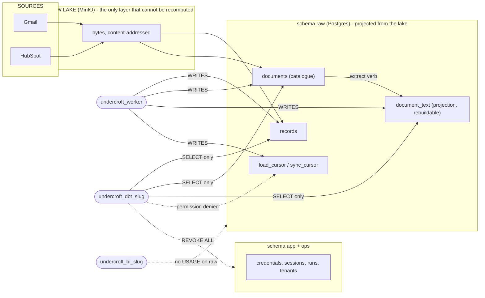
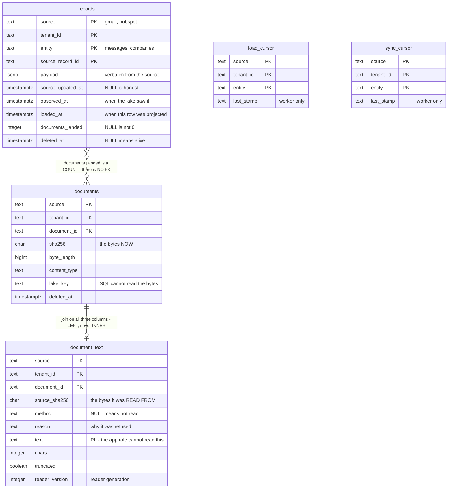

# The `raw` schema — a map for whoever writes the next query

> **Status: from source, then checked against a live instance (2026-09-23).** Written by
> reading `packages/db/sql/*.sql` at `bbbb2b4` (v1.19.0); the structural claims were then run
> through the SQL console as the tenant's `dbt` login. Every claim carries the file and line
> it came from, so a wrong one is cheap to disprove. What was **not** re-verified is marked in
> §9.
>
> **Why it exists.** Each migration is superbly commented on _why its own decision was made_.
> What is missing is the one thing a person sitting at the SQL console needs: **how the five
> tables fit together, and what each NULL means.** The console shows three table names and no
> map. This is the map.

---

## 1. Five tables, and the one sentence each

| Table               | One sentence                                                                                                                      | Who may `SELECT`                                |
| ------------------- | --------------------------------------------------------------------------------------------------------------------------------- | ----------------------------------------------- |
| `raw.records`       | One row per **record a source holds** — a HubSpot company, a Gmail message. Partitioned; `records_default` is the only partition. | worker · app · dbt                              |
| `raw.documents`     | The **catalogue** of files: a document exists, here is its sha256 and its lake key. **SQL cannot read its bytes.**                | worker · app · dbt                              |
| `raw.document_text` | What a document **says**, and **how we came to read it**. A _projection_ — droppable and rebuildable.                             | worker · dbt · app _(column-scoped, no `text`)_ |
| `raw.load_cursor`   | Where the last harvest of a stream stopped.                                                                                       | **worker only**                                 |
| `raw.sync_cursor`   | Same shape, for the sync path.                                                                                                    | **worker only**                                 |

⚠️ **The SQL console runs as the tenant's `dbt` login**, so it sees the first three and
**not** the two cursors. A cursor query there returns `permission denied`, not an empty set.
_(`040_grants.sql:36-37`, `180_document_text.sql:63`,
`repeatable/010_provision_tenant.sql:94-96`)_



---

## 2. How they join



**The join key between `documents` and `document_text` is all three columns.** Using
`document_id` alone is wrong: it is unique only _within_ a source and tenant.

```sql
LEFT JOIN raw.document_text t
  ON t.source      = d.source
 AND t.tenant_id   = d.tenant_id
 AND t.document_id = d.document_id
```

**`LEFT`, not inner** — and that is not a style choice. An inner join silently drops every
document nobody has run the extract verb over, which is exactly the set you are usually
looking for.

**`records` → `documents` has no key in SQL.** The link is `records.documents_landed`, a
_count_ the harvest wrote, not a reference. §5 says what its three states mean.
✅ **Verified on a live instance:** a document's `document_id` is **not** a record's
`source_record_id` — a join on those columns matches nothing. Do not attempt it; the only
tie between a record and its documents is the count.

---

## 3. The NULL dictionary — read this before writing any `WHERE`

Most defects in queries over this schema come from reading one NULL as another. Every
nullable column, and what its NULL actually asserts:

| Column                      | `NULL` means                                                                                                      | It does **not** mean |
| --------------------------- | ----------------------------------------------------------------------------------------------------------------- | -------------------- |
| `records.source_updated_at` | _"The source did not tell us when it changed."_ Honest by design.                                                 | "It never changed"   |
| `records.deleted_at`        | Alive.                                                                                                            | —                    |
| `records.documents_landed`  | _"This landing did not say."_ Written before the column existed ⇒ **will be read again**.                         | `0`                  |
| `documents.deleted_at`      | Alive.                                                                                                            | —                    |
| `document_text.method`      | **Not read.** Either never extracted _(no row at all)_ or extracted and refused _(row with a `reason`)_ — see §4. | "Has no text"        |
| `document_text.reason`      | The read **succeeded**; `method` says how.                                                                        | —                    |

🔑 **`method` and `reason` are a pair, and the database enforces it:**

```sql
CONSTRAINT document_text_said_why CHECK (method IS NOT NULL OR reason IS NOT NULL)
```

_(`180_document_text.sql:47`)_ — _"'No text, no reason' is the silent zero this whole codebase
refuses: it cannot be told from a document that genuinely says nothing."_

---

## 4. The trap that will get you: **three** states, not two

A document is in one of three states, and **two of them look identical** if you only count
`method`:

| State               | How to detect                                   | What to do about it          |
| ------------------- | ----------------------------------------------- | ---------------------------- |
| **Read**            | row exists, `method IS NOT NULL`                | nothing                      |
| **Never extracted** | **no row** in `document_text`                   | run the extract verb         |
| **Refused**         | row exists, `method IS NULL`, `reason` says why | write a reader, or accept it |

```sql
-- The three states, separated. One scan.
SELECT d.source,
       count(t.method)                                   AS read,
       count(*) FILTER (WHERE t.document_id IS NULL)     AS never_extracted,
       count(*) FILTER (WHERE t.document_id IS NOT NULL
                          AND t.method IS NULL)          AS refused,
       count(*)                                          AS total
FROM raw.documents d
LEFT JOIN raw.document_text t
  ON t.source = d.source AND t.tenant_id = d.tenant_id AND t.document_id = d.document_id
WHERE d.deleted_at IS NULL
GROUP BY d.source;
```

⚠️ **`count(method)` alone merges the last two.** That matters because the two call for
opposite actions — one is an operator running a command, the other is a developer writing
code. _(This is also what `repos/rawLake.ts:192` currently does for the Lake screen's
`readable`; the distinction is stated in that file's own comment at `:170-173`.)_

---

## 5. `documents_landed` — a count, deliberately not a boolean

_(`230_documents_landed.sql`)_

| Value  | Means                                                               |
| ------ | ------------------------------------------------------------------- |
| `NULL` | The landing did not say. **Not** held as complete ⇒ read once more. |
| `0`    | The landing said so: this record has no documents.                  |
| `> 0`  | That many landed.                                                   |

The history is worth one sentence, because it explains the shape: an ingest was OOM-killed
part-way and left **7,786 Gmail records with zero documents**, and every run afterwards
skipped all 7,786 _on presence alone_. `NULL` exists so those rows re-enter the queue exactly
once instead of never.

> _"`documents_landed = 0` on 7,786 rows is the sentence the outage could not say;
> `complete = true` would have been the same shape of claim that was already wrong."_

⚠️ It is the **one column in `raw.records` that is not a projection of the lake**. Rebuilding
`records` from the lake — always allowed — leaves every row `NULL`, and therefore re-reads
every source once. Slow, never wrong.

---

## 6. Two different sha256 columns

| Column                        | Is the hash of                                                   |
| ----------------------------- | ---------------------------------------------------------------- |
| `documents.sha256`            | The document's bytes, **now**.                                   |
| `document_text.source_sha256` | The bytes the text was read **from**, copied at extraction time. |

They differ exactly when a document changed after it was read — **and that mismatch is the
signal** that tells the next run to read it again. A match is what stops it re-OCRing
hundreds of megabytes that have not moved. _(`180_document_text.sql:20-23`)_

Add `reader_version` and you have the full backlog predicate: a row is offered again if its
bytes moved **or** its reader generation is older than `CURRENT_READER_VERSION`.
_(`240_reader_version.sql`)_

---

## 7. Row-level security — what you do **not** have to write

`raw.records`, `raw.documents` and `raw.document_text` all have RLS enabled, with the same
policy keyed on the login:

```sql
USING (tenant_id = raw.tenant_of(current_user))
```

_(`080_tenant_isolation.sql:110-111`, `180_document_text.sql:89`)_

⇒ From the console you **do not need** `WHERE tenant_id = …`. Adding it is harmless and makes
the query portable to the worker role, which sees every tenant.

⚠️ **Do not name the partition.** `raw.records_default` is not granted, so
`SELECT … FROM raw.records_default` is a permission error — deliberately, so the policy on the
parent cannot be side-stepped. _(`repeatable/010_provision_tenant.sql:87-89`)_

---

## 8. Time — three axes, and they answer different questions

| Column              | Answers                                          |
| ------------------- | ------------------------------------------------ |
| `source_updated_at` | _When did **they** change it?_ `NULL` is honest. |
| `observed_at`       | _When did the lake **see** it?_                  |
| `loaded_at`         | _When did this row get **projected**?_           |

⛔ None of them is a commit time, and none should be used as one. A query that filters history
with `loaded_at <= t` is asking _"what had been projected by t"_, which is not the same
question as _"what did the system know at t"_.

---

## 9. `payload` — the shape, and where the business fields live

`raw.records.payload` is the source's own JSON, stored verbatim. Its shape is the source's,
not ours — so a query reads it with `payload -> …`, and the keys are whatever that source
returns.

| Source / entity                            | Top-level payload keys                                                    | Where the fields are                                                                                                                    |
| ------------------------------------------ | ------------------------------------------------------------------------- | --------------------------------------------------------------------------------------------------------------------------------------- |
| `gmail` / `messages`                       | `id`, `threadId`, `internalDate`, `labelIds`, `headers`, `snippetOmitted` | `headers` (an object). 🟢 `snippetOmitted` is `true` — the body preview is **deliberately not stored** here; the body is a document.    |
| `hubspot` / `companies`·`contacts`·`deals` | `id`, `createdAt`, `updatedAt`, `archived`, `url`, **`properties`**       | **Everything useful is under `properties`** — `payload->'properties'->>'name'`, etc. These mirror the HubSpot API's own property names. |
| `hubspot` / `associations`                 | `from`, `to`                                                              | `from` = `{id}`; `to` = an **array** of `{toObjectId, associationTypes}`.                                                               |

⚠️ **Two traps confirmed on a live instance, worth a doc line because a query will hit them:**

- **HubSpot `properties` returns _every_ property the portal defines, most of them empty.**
  A key existing under `properties` does **not** mean it has a value. Filter
  `WHERE payload->'properties'->>'x' IS NOT NULL AND … <> ''`, or you will count blanks.
- **An `associations` row does not carry the _object type_ of either end** — only ids and
  `associationTypes`. To know whether an edge is contact↔company or deal↔company, resolve the
  ids against the other tables. The graph is reconstructable, not self-describing.
- **`deals.dealstage` is a pipeline-stage id, not a label.** `closedwon`/`closedlost` appear
  only when a deal sits in the _default_ pipeline's named stages; custom pipelines store
  numeric stage ids whose meaning lives in the (uncrawled) pipeline definition.

> ⛔ **No customer values are shown here** — only the source's field _names_, which are public
> API vocabulary. Per-tenant coverage numbers live in a private measurement note, not in this
> repo.

---

## 10. What this document does **not** establish

- ⛔ **Data correctness/completeness is a different question** the schema cannot answer — only
  queries over real rows can, and those depend on which sources have actually been crawled.
- ⚠️ **Not re-verified against a live instance** _(read from DDL only)_: the `document_text`
  CHECK constraint, the partition permission error, and the cursor-tables `permission denied`.
  They are stated from the migration source and should be treated as such until run.
- ⛔ `raw.sync_cursor` is listed for completeness only; its semantics were not studied.
- ⛔ The `app` and `ops` schemas are out of scope. The `dbt` login has no `USAGE` on either,
  by explicit `REVOKE`.
