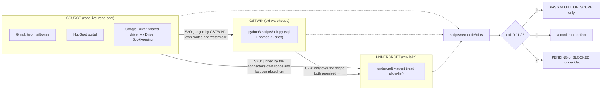

# Design: Live reconciliation of the lake against its sources and the old warehouse

Status: proposed with the suite in `scripts/reconcile/`. Nothing here changes production code.

## The question

When a record exists in a source, can we show that it reached the warehouse the way the scope
and the data contract say it should -- and when it did not, say which of four things happened:
it is outside the scope, it has not been synchronised yet, it was dropped by a declared rule, or
it is genuinely missing or wrong?

An audit finding that cannot be re-run is an opinion. Every finding this suite reports is a
test case with an id, preconditions, an expected result that does not come from the code under
test, the actual result, and evidence a reader can open.

## Three systems, three independent legs

- **S2O** -- the source against OSTWIN, judged by what OSTWIN itself promises (for Gmail, the
  queries on its own coverage record; for Drive, the folders it scans).
- **S2U** -- the source against the lake, judged by what the connector promises (Gmail labels,
  HubSpot objects and properties, Drive folders and file types).
- **O2U** -- OSTWIN against the lake, only over the part both promised. OSTWIN is not the source
  of truth; this leg shows where the two warehouses disagree, not which one is right.

The legs are independent: each reads its own reference. A leg never borrows another leg's
answer to decide its own verdict.

## Verdicts and statuses

A record in one leg gets one verdict. Absence is tried in this order, and `MISSING` is what is
left when no declared reason applies:

| Verdict            | Meaning                                                                                                                           |
| ------------------ | --------------------------------------------------------------------------------------------------------------------------------- |
| `MATCH`            | present once, contract fields equal                                                                                               |
| `EXCLUDED_BY_RULE` | absent because a rule the target's contract names dropped it (OSTWIN's discard list; a candidate route attribution did not claim) |
| `OUT_OF_SCOPE`     | outside the target's confirmed scope (a label the connector does not read; a folder it is not given)                              |
| `NOT_YET_SYNCED`   | newer than the target's last completed run, changed after it, or held in a layer the target has not published yet                 |
| `MISSING`          | in scope, synchronised, absent                                                                                                    |
| `EXTRA`            | held by the target, absent from the reference, and attributable to this leg                                                       |
| `DUPLICATE`        | one key answered by several target rows                                                                                           |
| `CONTENT_MISMATCH` | present once, a contract field differs, and the source did not change since the target read it                                    |

A case gets one status. `PENDING` and `BLOCKED` are never folded into `PASS`:

| Status         | When                                                                             | Exit code |
| -------------- | -------------------------------------------------------------------------------- | --------- |
| `PASS`         | no defect verdict, the target's run completed, something was compared            | 0         |
| `OUT_OF_SCOPE` | the confirmed scope says the question does not apply (recorded, with the reason) | 0         |
| `FAIL`         | any `MISSING`, `EXTRA`, `DUPLICATE` or `CONTENT_MISMATCH`                        | 1         |
| `PENDING`      | no defect, but the target's run has not completed or records are newer than it   | 2         |
| `BLOCKED`      | a credential, identity, permission or read failed                                | 2         |

A run exits 1 if any case failed, else 2 if any case was undecided, else 0. A run that dies
part-way exits 2.

## Scope, per source

**Gmail.** Keys are `mailbox:gmailId`, because a Gmail id names a message in one mailbox (the
same letter in two mailboxes is two messages; issue #143). The RFC `Message-ID` is compared as a
field and used to find cross-mailbox id conflicts; the thread id identifies nothing on its own.
Header names are case-insensitive (`Message-Id`), and the source side reads them that way.

- Mailbox-wide S2U: one Gmail listing per label the connection reads, unioned -- the connector's
  own contract -- against every lake row of the mailbox. A lake row whose labels never included
  a scope label is `EXTRA`; one that did and has since been relabelled or expired from Spam is
  counted as retained history.
- Per client S2O: OSTWIN's own route queries, asked of Gmail now. A `scope` hit OSTWIN lacks is
  `MISSING` only if older than OSTWIN's published harvest, not on its discard list, and not held
  in its newer harvest awaiting review. `label` and `attachment` hits are candidates that
  attribution may refuse. Spam and Trash are out of OSTWIN's scope by ruling.
- Per client S2U: the client's scope-query messages under a label Undercroft reads.
- Per client O2U: OSTWIN's messages whose recorded labels Undercroft reads.
- The source's identity is checked first: the token's profile address must equal the configured
  address and the lake connection's account, or every comparison for that mailbox is `BLOCKED`.

**HubSpot.** Both warehouses mirror the whole portal, so companies, contacts and deals are
compared portal-wide by object id, on the fields every contract preserves (S2U only on fields
the connector reads: its property floor plus the connection's selection). Deal-to-company links
are compared as `deal->company` pairs. Per client, the deals reached from the client's company
must be the same set in each system, and no two may share name, amount and close date. Quotes are
not in the lake's contract: their S2U and O2U legs are `OUT_OF_SCOPE`, and the gap against the
business requirement is stated once (`HS-REQ-OBJ-001`). A record changed after a warehouse's
snapshot began is lag; one created after it cannot be held against it.

**Drive.** The warehouses do not read the same trees: Undercroft reads the Incorp client folders
on the Shared drive and the Bookkeeping root; OSTWIN reads the Incorp client folders on My Drive
and the same Bookkeeping root. S2U joins by Drive file id and compares mime type, md5, size,
parents and modified time; a second leg checks that every file of a type the connection reads has
a stored document of the same byte size (Google-native files are exported, not compared by
bytes). S2O joins OSTWIN's inventory by Drive id when OSTWIN kept one, else by path relative to
the client folder. O2U runs over Bookkeeping (one tree) and over Incorp files whose relative path
exists in both copies; a file with no Shared drive counterpart is `OUT_OF_SCOPE`. No Drive leg
concludes `MISSING` before the lake's `files` run has completed. md5 is compared, never used as
identity.

## Test groups

| Group                     | Where                                                                                                                                                                                                                                     | Needs                     |
| ------------------------- | ----------------------------------------------------------------------------------------------------------------------------------------------------------------------------------------------------------------------------------------- | ------------------------- |
| Unit                      | `scripts/reconcile/core.test.ts`                                                                                                                                                                                                          | nothing                   |
| Contract                  | `adapters.test.ts` -- each adapter against a stand-in that reproduces the behaviour it defends against (ask.py's 60-character clip, the 200-row named-query cap, the lake's 50-row pages, Gmail page tokens, header case, rate-limit 403) | nothing                   |
| Integration / E2E offline | `gmailSuite.test.ts` -- the whole Gmail suite over an invented world held by the stand-ins                                                                                                                                                | nothing                   |
| Regression                | `regression.test.ts` -- one case per historical finding, pinned from both sides                                                                                                                                                           | nothing                   |
| Live reconciliation       | `scripts/reconcile/live/records.live.ts` (one test per real record), or `bun run scripts/reconcile/cli.ts --config <file>`                                                                                                                | credentials, local config |

The offline groups run in `bun run test` with no network and no credential. The real-data checks
sit in their own folder, `scripts/reconcile/live/`, named `*.live.ts` so `bun test`'s default
pattern never collects them: they are not part of CI, run only when named by path with
`UNDERCROFT_LIVE=1`, and cannot start without the local config. A run that cannot decide exits 2.

## Read-only by construction

- Undercroft is read through `undercroft --agent` with an allow-list of read procedures; any
  other procedure is refused before a process is spawned (`lake query` is refused because the CLI
  itself labels it a write). The tenant's `allowWrites` flag is not relied on.
- OSTWIN is read through `ask.py`, whose `sql` accepts only `SELECT`/`WITH`. The adapter defeats
  the output's 60-character cell clip by carrying each row as hex-encoded JSON in short chunks.
- Google and HubSpot are read with GETs and HubSpot's `batch/read`; the only other POST is the
  OAuth token refresh.

## Evidence and data protection

Detailed evidence (every non-matching record, its key, verdict, reason and differing fields) is
written only under the configured `outDir`, which `loadConfig` refuses if it is inside the
repository. The summary report carries case ids, client labels (CASE-IDs), statuses and counts.
Real configuration lives in `fixtures/live/` (git-ignored) or outside the repository.

## Traceability

Requirement (`REQ-*`, in each case) -> data contract (named in each case) -> test case (id) ->
execution (run id, watermarks) -> evidence (files under the run folder) -> finding (the
`finding` field) -> issue -> regression test (`regression.test.ts`). The case list is in
[the case matrix](cases.md); how to run it is in
[the runbook](runbook.md).
