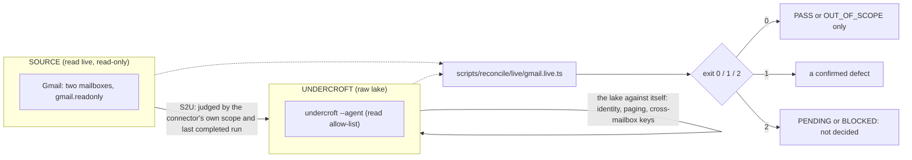

# Design: Live reconciliation of the Gmail lake against its mailboxes

Status: proposed with the suite in `scripts/reconcile/`. Nothing here changes production code.

## The question

When a message exists in a mailbox, can we show that it reached the lake the way the
connection's scope and the connector's contract say it should -- and when it did not, say which
of four things happened: it is outside the scope, it has not been synchronised yet, it was
dropped by a declared rule, or it is genuinely missing or wrong?

An audit finding that cannot be re-run is an opinion. Every finding this suite reports is a
test case with an id, preconditions, an expected result that does not come from the code under
test, the actual result, and evidence a reader can open.

## Two directions

```mermaid
flowchart LR
  subgraph SRC["SOURCE (read live, read-only)"]
    GM["Gmail: two mailboxes, gmail.readonly"]
  end
  subgraph UC["UNDERCROFT (raw lake)"]
    CLI["undercroft --agent (read allow-list)"]
  end
  SRC -- "S2U: judged by the connector's own scope and last completed run" --> UC
  UC -- "the lake against itself: identity, paging, cross-mailbox keys" --> UC
  RUN["scripts/reconcile/live/gmail.live.ts"] --> VERDICT{"exit 0 / 1 / 2"}
  SRC -.-> RUN
  UC -.-> RUN
  VERDICT -- "0" --> OK["PASS or OUT_OF_SCOPE only"]
  VERDICT -- "1" --> FAIL["a confirmed defect"]
  VERDICT -- "2" --> INC["PENDING or BLOCKED: not decided"]
```

- **S2U** -- the mailbox against the lake, judged by what the connector promises: the labels
  the connection reads, the fields it keeps, the attachment types it allows. Message 1:1 and
  attachment 1:1.
- **The lake against itself** -- the token reads the mailbox the lake connection names; the lake
  listing is read to its end with no id twice and the count its summary declares; one Gmail id
  never names two different letters across the two mailboxes.

## Verdicts and statuses

A record gets one verdict. Absence is tried in this order, and `MISSING` is what is left when
no declared reason applies:

| Verdict            | Meaning                                                                                                     |
| ------------------ | ----------------------------------------------------------------------------------------------------------- |
| `MATCH`            | present once, contract fields equal                                                                         |
| `EXCLUDED_BY_RULE` | absent because a rule the connector's contract names dropped it (an attachment over the 25 MiB ceiling)     |
| `OUT_OF_SCOPE`     | outside the connection's confirmed scope, or retained by the connector's policy after it left the scope     |
| `NOT_YET_SYNCED`   | newer than the lake's last completed run, or changed after it                                               |
| `MISSING`          | in scope, synchronised, absent                                                                              |
| `EXTRA`            | held by the lake, absent from the reference, and no policy explains it                                      |
| `DUPLICATE`        | one key answered by several lake rows                                                                       |
| `CONTENT_MISMATCH` | present once, a contract field differs, and the source did not change since the lake read it                |
| `BLOCKED`          | absent or unexplained, but a condition the defect verdict needs has no evidence (the scope a run read, say) |

A case gets one status. `PENDING` and `BLOCKED` are never folded into `PASS`:

| Status         | When                                                                             | Exit code |
| -------------- | -------------------------------------------------------------------------------- | --------- |
| `PASS`         | no defect verdict, the lake's run completed, something was compared              | 0         |
| `OUT_OF_SCOPE` | the confirmed scope says the question does not apply (recorded, with the reason) | 0         |
| `FAIL`         | any `MISSING`, `EXTRA`, `DUPLICATE` or `CONTENT_MISMATCH`                        | 1         |
| `PENDING`      | no defect, but the lake's run has not completed or records are newer than it     | 2         |
| `BLOCKED`      | a credential, identity, permission or read failed, or a verdict lacks evidence   | 2         |

A run exits 1 if any case failed, else 2 if any case was undecided, else 0.

## Scope

Keys are `mailbox:gmailId`, because a Gmail id names a message in one mailbox (the same letter
in two mailboxes is two messages; issue #143). The RFC `Message-ID` is compared as a field and
used to find cross-mailbox id conflicts; the thread id identifies nothing on its own. Header
names are case-insensitive (`Message-Id`), and the source side reads them that way.

- **Messages.** One Gmail listing per label the connection reads, unioned -- the connector's own
  contract -- against every lake row of the mailbox. Each listing is proven complete by the
  label's own `messagesTotal`; a listing that leaves Spam and Trash out is proven by listing
  again with them and showing every extra message is in Spam or Trash. Present messages are
  compared on the fields the connector keeps (`id`, `threadId`, `internalDate`, six headers),
  exactly; labels are not, because a held message is never read again. Undercroft records no
  label selection per run and Gmail no time a label was applied, so an absent message older than
  the last completed run is `BLOCKED`, never `MISSING`. A lake row that held a selected label and
  has left it (relabelled, trashed, deleted) is retained history (`OUT_OF_SCOPE`); one whose
  labels never held a current selected label is `BLOCKED`.
- **Attachments.** Every part the connector would store (depth-first index, an `attachmentId`, a
  type the connection's `fileTypes` allow) against the lake's documents, on type and size. A
  part declared over 25 MiB is `EXCLUDED_BY_RULE`: the connector refuses it before fetching. An
  absent attachment is `BLOCKED` for the same reason as a message; a document on a part number
  that is no attachment in a message still in the mailbox is `EXTRA`, since a Gmail message
  never changes.
- **Identity first.** The token's profile address must equal the configured address and the
  lake connection's account, or every comparison for that mailbox is `BLOCKED`.

## Reading without re-spending quota

- Gmail message reads are paced (330 ms apart per mailbox by default, three at a time); a read
  refused by the quota is tried once more after a pause. An access token that expires mid-run
  is refreshed once and the read repeated.
- Every Gmail read is appended to `<outDir>/gmail-cache.jsonl` as it lands, so a repeated run
  in one session reads only what it has not read. A cached read's labels are as old as the
  cache: a held message the live listing no longer returns, whose cached labels still hold a
  selected label, is read again before it is judged.
- Lake walks may be reused from `<outDir>/lake-cache/` within their age, never once a run of
  their source has ended -- or is still running -- after the walk was taken. Each reused walk's
  time is written into the run's watermarks.

## Test groups

| Group                     | Where                                                                                                                          | Needs                     |
| ------------------------- | ------------------------------------------------------------------------------------------------------------------------------ | ------------------------- |
| Unit                      | `scripts/reconcile/core.test.ts`, `config.test.ts`                                                                             | nothing                   |
| Contract                  | `adapters.test.ts` -- each adapter against a stand-in that reproduces what it defends against (50-row pages, header case, 403) | nothing                   |
| Integration / E2E offline | `gmailSuite.test.ts` -- the whole Gmail suite over an invented world held by the stand-ins                                     | nothing                   |
| Regression                | `regression.test.ts` -- one case per historical finding, pinned from both sides                                                | nothing                   |
| Live reconciliation       | `scripts/reconcile/live/gmail.live.ts`, run by `task ci:reconcile-gmail-live` (one test per real record)                       | credentials, local config |

The offline groups run in `task ci:test` with no network and no credential. The real-data
checks sit in their own folder, `scripts/reconcile/live/`, named `*.live.ts` so `bun test`'s
default pattern never collects them: they are not part of CI, run only when named by path with
`UNDERCROFT_LIVE=1`, and cannot start without the local config.

## Read-only by construction

- Undercroft is read through `undercroft --agent` with an allow-list of read procedures; any
  other procedure is refused before a process is spawned (`lake query` is refused because the CLI
  itself labels it a write). The tenant's `allowWrites` flag is not relied on.
- Gmail is read with GETs under a `gmail.readonly` token; the only POST is the OAuth token
  refresh.

## Evidence and data protection

Detailed evidence (every non-matching record, its key, verdict, reason and differing fields) is
written only under the configured `outDir`, which `loadConfig` refuses if it is inside the
repository. The summary report carries case ids, statuses, counts and reasons. Real
configuration lives in `fixtures/live/` (git-ignored) or outside the repository.

## Traceability

Requirement (`REQ-*`, in each case) -> data contract (named in each case) -> test case (id) ->
execution (run id, watermarks) -> evidence (files under the run folder) -> finding (the
`finding` field) -> issue -> regression test (`regression.test.ts`). The case list is in
[the case matrix](cases.md); how to run it is in [the runbook](runbook.md).
